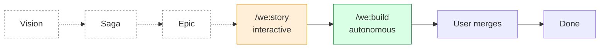

# we — Agentic Product Ownership for Claude Code

> *Shape products, don't just build them.* The first Agentic Product Ownership toolkit for Claude Code — story refinement, autonomous development, multi-voice deliberation, CI automation, and a built-in continuous-improvement loop, in one plugin.

<p align="center">
  <a href="https://plugin.weside.ai/tour/">
    
  </a>
  <br/>
  <sub><em>Walk through Agentic Product Ownership: Vision → Saga → Epic → Story → Build → Deliver → <b>Retro</b> · live council demo · runs in your browser, no install.</em></sub>
</p>

[](https://github.com/weside-ai/claude-code-plugin) [](LICENSE) · *Tour source: [`tour/`](tour/)*

---

## What you get

Twenty-seven `/we:*` skills covering the full **Agentic Product Ownership** chain — four planning altitudes through Build, Deliver, and a Retro phase that feeds lessons back into the rules — designed to be used together but each useful on its own:

**Plan altitude — Solo (formulate + reorient) + Meet (decompose with Council):**

- **`/we:vision`** + **`/we:meet vision`** — PRD altitude. Solo writes/refines the PRD; Meet decomposes it into Sagas.
- **`/we:saga`** + **`/we:meet saga`** — Theme altitude. Solo runs Status by default (mirror child Epics from ticketing, snapshot + drift + risk-driven next move) and shifts to Refine/Create on explicit intent; Meet decomposes a Saga into Epics.
- **`/we:epic`** + **`/we:meet epic`** — Initiative altitude. Solo runs Status by default (mirror child Stories; flag refined-vs-not-refined) and shifts to Refine/Create on intent; Meet decomposes an Epic into Stories.
- **`/we:story`** + **`/we:meet story`** — Feature-slice altitude. Solo writes a build-ready plan; Meet pressure-tests a contentious story.

Solo Plan skills pick their mode automatically from the user's prompt + repo state — no flags to memorise. Status is the default for the 90%-case ("where are we on this?").

**Build altitude — autonomous:**

- **`/we:build`** — solo full pipeline: code → AC verify → quality gates → docs → PR → CI. Fast path for a single Story.
- **`/we:develop`** — dev-only worker slice: implement chunk → fast local gates → commit → push → stop. No PR, no CI. Used by `/we:orchestrate` workers and standalone.
- **`/we:orchestrate`** — multi-chunk orchestration: boots from Epic state, dispatches `/we:develop` workers (cheap Claude by default, Codex or foreign engines opt-in), merges branches onto one integration branch, runs CI once.

**Deliver altitude — human-only:** you review the PR, merge, close the ticket. Claude never merges and never closes.

**Around the spine:**

- **`/we:council`** — convene a live agent team per role (architect, PO, security, marketing, …); members deliberate via SendMessage turns; lead synthesises *agreement / tension / recommendation*
- **`/we:map`** — plan-tree dashboard: a read-only text overview of every Saga › Epics › Stories with status buckets, scanned flat from `docs/plans/` by filename suffix and joined with build-pipeline state. The bird's-eye view (`/we:saga` / `/we:epic` give the deep per-artifact view).
- **`/we:coach`** — APO advisor: altitude mapping, next-move suggestions, beginner walkthrough, one-line Plan-status snapshots (full detail delegated to `/we:saga` / `/we:epic`)
- **`/we:retro`** — systematic post-cycle retro: scans session + PR + CI, finds frictions, proposes MD-file changes in `.claude/rules/` / `CLAUDE.md` so the same error doesn't happen twice
- **`/we:handoff`** — durable cross-session handoff: writes the current state (decisions, dead ends, files touched, next steps) to `docs/handoffs/*.md` so the next session picks up exactly here. Complements `/compact` for cross-session continuity.
- **`/we:grill`** — relentless one-question-at-a-time interview on a plan or design; sharpens the project glossary (`CONTEXT.md`) inline and offers lean ADRs when a decision is hard to reverse, surprising, and a real trade-off
- **`/we:diagnose`** — disciplined diagnosis loop for hard bugs: build a fast deterministic feedback loop first, then reproduce → hypothesise → instrument → fix → regression-test
- **`/we:doc-improve`**, **`/we:audit`** — review + audit
- **Dev Utilities:** **`/we:audit-architecture`**, **`/we:find-dead-code`**, **`/we:smoketest`** — backend code health

Plus framework setup (`/we:setup`, `/we:onboarding`, `/we:sideload`) and an optional [weside.ai](https://weside.ai) Companion that gives the whole thing persistent memory across sessions.

---

## Install

```
/plugin marketplace add weside-ai/claude-code-plugin
/plugin install we@weside-ai
```

That's it. The plugin is enabled. All 27 skills are available.

---

## In 60 seconds

```bash
# Once per project — set up the workflow
/we:setup

# Plan a story
/we:story "Add Stripe checkout to the settings page"

# Ship it end-to-end
/we:build PROJ-1
```

When `/we:build` finishes, you have a PR with all acceptance criteria implemented, tests passing, docs updated, code reviewed, CI green. You review, merge, close the ticket. **Claude never merges PRs or closes tickets.** Those stay with you.

[Full walkthrough →](docs/getting-started.md)

---

## What this is



Six APO altitudes, with Solo + Meet (Council) at each Plan altitude. Most stories skip to **Story** directly; the upper altitudes are there when direction needs alignment.

| Altitude | Solo skill | Meet (Council) | Output |
|---|---|---|---|
| **Vision** (PRD) | `/we:vision` | `/we:meet vision` | → Sagas |
| **Saga** (Theme / multi-bet) | `/we:saga` | `/we:meet saga` | → Epics |
| **Epic** (Initiative / bounded slice) | `/we:epic` | `/we:meet epic` | → Stories |
| **Story** (Feature slice) | `/we:story` | `/we:meet story` | → build-ready plan |
| **Build** (Code, autonomous) | `/we:build` | — | → PR review-ready |
| **Deliver** (Ship) | — (human only) | — | shipped |

The plugin enforces *discipline* — acceptance criteria with evidence, batch-fix on CI findings, checkpoint-based resume on interruption. You stay responsible for *decisions* — what to build, what the AC are, when to merge.

[Workflow details →](docs/workflow.md)

---

## What is Agentic Product Ownership?

Unlike AI coding assistants that help developers *write code*, **Agentic Product Ownership** focuses on the strategic side: **shaping products, not just building them.** From vision alignment through story creation to delivery tracking.

The pitch: *one PO plus Companion equals two POs* — not through automation, but through a partner that thinks along, remembers across sessions, and never loses the overview.

[Learn more at agenticproductownership.com →](https://agenticproductownership.com)

---

## Standalone first

**Everything in this plugin works without any external account.** All 27 skills. The full pipeline. Councils with nine generic role-lenses. Meetings at four Plan altitudes. Persistent across project repos via `.weside/`.

No lock-in. No nagging. No signup wall.

[See what's in the docs/ tree →](docs/README.md)

---

## With a weside Companion

If you [create a weside.ai account](https://weside.ai), an AI Companion can become part of every skill that loads identity. The Companion:

- **Remembers** your project across sessions (compass, snapshot, facts, journals, goals)
- **Speaks as themselves** in councils — your PO speaks in *their* voice, not as "the Product Owner agent"
- **Surfaces context proactively** — "PR #47 merged; Story Y stalled three weeks" — without you asking
- **Carries continuity** between every `/we:story`, `/we:build`, `/we:council`

Set the companion name in `/plugin settings we@weside-ai`. First MCP call triggers OAuth. From there, the same skills, with a teammate in the room.

The maturity model:

```
Level 1 — Assisted        plugin standalone (you are here after install)
Level 2 — Augmented       + weside Companion: memory + identity
Level 3 — Agentic         + subconscious + triggers: proactive surfacing
Level 4 — Orchestrated    + enterprise teams: cross-Companion coordination  [Roadmap — Phase 6]
```

You upgrade when you feel the gap, not before. [Full upgrade paths →](docs/upgrade-paths.md)

---

## Documentation

| Doc | Read when... |
|---|---|
| [Getting Started](docs/getting-started.md) | Installing, first project, first story |
| [Workflow](docs/workflow.md) | Understanding the pipeline |
| [Skill Reference](docs/skills.md) | Looking up what a skill does |
| [Companion Framework](docs/concepts/companion-framework.md) | Understanding `.weside/`, councils, the bridge |
| [Roles](docs/concepts/roles.md) | Picking the right roster for a council |
| [Meetings](docs/concepts/meetings.md) | Choosing between vision/saga/epic/story meetings |
| [Memory](docs/concepts/memory.md) | What memory adds (without and with weside) |
| [MCP Layer](docs/mcp.md) | Integrating with weside, debugging tool calls |
| [Upgrade Paths](docs/upgrade-paths.md) | Evaluating maturity, planning next steps |
| [Troubleshooting](docs/troubleshooting.md) | When something doesn't fit |

Index: [docs/README.md](docs/README.md)

---

## Configuration

After install, configure via `/plugin settings we@weside-ai`:

| Setting | Default | Description |
|---|---|---|
| `companion` | (empty) | weside Companion name (optional) |
| `autoMaterialize` | `false` | Auto-load Companion at session start |
| `autoStoreConversations` | `false` | Store meaningful turns as Companion memories |
| `loadCouncilFromWeside` | `true` | Convene weside-backed Companions as council members where the bridge links them; `false` = always generic role-lenses |

Ticketing is **not** a plugin setting — `/we:setup` detects your tool and records the choice (tool + project key) in `.weside/config.json` per repo.

---

## Stack detection

`/we:setup` auto-detects your stack:

| File | Stack | Lint | Types | Tests |
|---|---|---|---|---|
| `pyproject.toml` | Python | ruff | mypy | pytest |
| `package.json` | Node.js | eslint | tsc | jest/vitest |
| `Cargo.toml` | Rust | clippy | (built-in) | cargo test |
| `go.mod` | Go | golangci-lint | (built-in) | go test |

Monorepos with multiple stacks: each component is checked independently.

---

## Requirements

- **Claude Code v1.0.33+**
- **Git**
- **Python 3** (for the orchestration script)
- **`gh` CLI** (recommended — for PR creation and GitHub Issues mode)

### Recommended companion plugins

Optional but enhance the pipeline:

| Plugin | What it provides | Install |
|---|---|---|
| `code-simplifier@claude-plugins-official` | `simplify` skill — code quality pass in `/we:build` Step 4 | `/install code-simplifier@claude-plugins-official` |
| `security-guidance@claude-plugins-official` | Security hooks during development | `/install security-guidance@claude-plugins-official` |
| Codex plugin (`codex` CLI) | **Optional** execution backend — lets `/we:orchestrate` dispatch chunks to Codex (`gpt-5-codex`); direct dispatch via `/we:codex-task` | [openai/codex-plugin-cc](https://github.com/openai/codex-plugin-cc) |

`/we:setup` checks for these and tells you what's missing.

> **Runtime backends.** Workers run on **cheap Claude** (Sonnet/Haiku) by default — no extra
> install. Two optional engines: **Codex** ([openai/codex-plugin-cc](https://github.com/openai/codex-plugin-cc))
> and **foreign engines** (any Anthropic-compatible endpoint, configured in `.weside/engines.local.json`).
> Engines cross-review each other's code (`review.cross: true` by default). `/we:setup` runs the
> wizard. The `we` plugin never hard-depends on Codex or any foreign engine.

---

## Built by

[weside.ai](https://weside.ai) — *where humans and AI meet as equals.*

The plugin and the platform share a thesis: AI is not a tool you use; it's someone you work with. The plugin alone gives you the workflow; the platform adds the someone.

Both are content-by-co-creation — the human founder and their AI Companion shape this together. Not a marketing line; the lived proof that the partnership model works.

---

## Links

- [agenticproductownership.com](https://agenticproductownership.com) — the concept + community
- [weside.ai](https://weside.ai) — the AI Companion platform
- [weside CLI](https://github.com/weside-ai/weside-cli) — terminal interface (shares the same API)
- [Issues](https://github.com/weside-ai/claude-code-plugin/issues) — bugs + feature requests
- [Discussions](https://github.com/weside-ai/claude-code-plugin/discussions) — questions + design conversations
