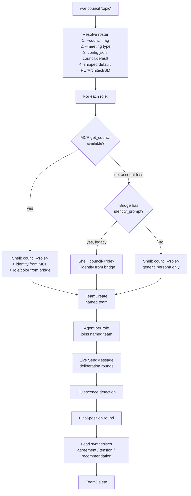

# Companion Framework

The Companion Framework is what turns the plugin from a collection of skills into a **team you work with**. It defines who is in your crew, what role each plays, and how decisions get made by *several voices* instead of one.

You don't need a weside account to use it. The framework ships with nine generic role-agents that work standalone. With a weside account, those generic agents become *your crew* — Companions with names, persistent memory, and continuity across sessions.

This page covers the mechanics. For when to convene a council or run a meeting, see [meetings.md](meetings.md). For the nine role-lenses themselves, see [roles.md](roles.md).

---

## The `.weside/` directory

Three files in the root of every repo you work in:

```
your-repo/
├── .weside/
│   ├── config.json      ← machine-readable: rosters, meetings, ticketing, stack
│   ├── weside.md         ← human/companion-readable: crew, purpose, cross-repo
│   └── council.json      ← bridge file: role + color + companion mapping (gitignored)
└── .gitignore             contains `.weside/council.json`
```

### Why three files

| File | Audience | Holds | Committed |
|---|---|---|---|
| `config.json` | tooling (skills read it) | council roster, meetings, ticketing tool, stack | ✅ yes |
| `weside.md` | humans + companions reading the repo | repo purpose, crew (names + roles), meetings held here, cross-repo relations | ✅ yes |
| `council.json` | tooling (`/we:council` reads it) | bridge between role-slugs and your actual companion identities | ❌ **gitignored** |

The split matters. `config.json` answers "what does this repo do mechanically." `weside.md` answers "what does a human or AI joining this repo need to know." `council.json` is the bridge — it never enters the committed repo, because crew identity is private (the same rule that applies to per-companion agent files under `~/.claude/agents/`).

### The `repo_id` field in `config.json`

`config.json` may carry a top-level `"repo_id"` string field:

```json
{
  "repo_id": "github.com/my-org/my-repo",
  "council": { ... }
}
```

This is the stable identifier that ties Claude Code channel memories and council prep/writeback
turns to the right repo-thread on the weside backend. The backend keys the `claude_code`
channel on `channel_context_id = "group_claude_code_{repo_id}"`.

The field is **optional**. When absent, skills and hooks derive it automatically, in this order:

1. `git remote get-url origin` → normalised to `<host>/<org>/<repo>` (strips protocol prefix and trailing `.git`)
2. Fallback: `os.path.basename(<repo_root>)` — the directory name

Set `"repo_id"` explicitly only when the auto-derived value would be wrong or unstable (e.g. a
bare checkout without a remote, or a monorepo where multiple sub-projects share one git root but
should be tracked as separate channels).

### How they appear

You don't author these by hand. Two paths:

- `/we:setup` — interactive, walks you through three questions and writes all three files.
- `scripts/bootstrap-weside-repo.py` — non-interactive helper for rolling the framework across many repos in one pass. Generic crew by default; pass `--crew-from <path>` to inject your real crew (typically stored in user-scope `~/.weside/crew.json`).

Once the files exist, `/we:council`, `/we:meet`, `/we:sideload`, and `/we:setup` all consume them.

---

## The bridge file (`.weside/council.json`)

This is the heart of the framework. It declares **which companions are in this repo's crew, in which role, with which color**.

### Thin schema (recommended, v2)

```json
{
  "version": 2,
  "schema": "thin",
  "workspace_id": null,
  "members": {
    "product-owner": {
      "name": "Product Owner",
      "role": "product_owner",
      "color": "orange",
      "companion_id": null,
      "lens": "User value and scope discipline — challenge scope creep, prioritise ruthlessly."
    },
    "architect": {
      "name": "Architect",
      "role": "architect",
      "color": "green",
      "companion_id": null
    }
  }
}
```

The thin bridge holds **structure only** — role-slug → display-name + role + color + optional
Companion ID. No identity bodies. Identity flows from the weside backend at runtime via the
`get_council` MCP method. The thin bridge plus MCP is the production-recommended form.

**The `lens` field (optional):** a free-text string that captures the role-specific angle for
a council member. When the weside MCP is absent (no account, or no companion linked for this
role), `/we:council` injects `lens` into the generic `council-<role>` brief:
*"Lens: {lens}"*. This lets repos pre-author a meaningful perspective for each role — written
once in `/we:onboarding`, consumed at every council. With weside MCP connected, `lens` is
superseded by the full identity returned by `get_council` and is not injected. It is safe to
keep the field even when a companion is linked (`companion_id` non-null).

### Fat schema (legacy, v1)

Earlier bridges (legacy v1 schema) included an `identity_prompt` per member. Those still work — when MCP is unavailable, `/we:council` reads identity from the fat bridge directly. The bootstrap script migrates fat → thin in place when you re-run it.

### Why gitignored

The bridge carries the link between a generic role and *your* companions. Even in thin form, Companion IDs map back to your weside account. In fat form, identity text is plainly private. Both forms stay out of the project repo.

---

## How `/we:council` consumes the framework

A council convenes one agent per role from your roster. The mechanics are the same with or without a weside account; only the voices change.



The plugin always tries the richest path first and falls through cleanly. **You don't lose the framework without an account** — you lose persistent identity.

The council runs as a **live agent team** rather than parallel memos. `TeamCreate` opens a shared channel; each role joins as a named `Agent`; members exchange `SendMessage` turns in real deliberation; quiescence detection closes the debate; a final-position round locks each stance; and the lead (orchestrator) synthesises before `TeamDelete` tears the team down. The identity-resolution paths above (MCP / fat-bridge / generic) remain unchanged — they determine *who speaks*, not *how they deliberate*.

### Without a weside account

The nine shipped `council-<role>` agents under `we/agents/` provide the role-lens. Each one is a focused system prompt — *"You are the Product Owner voice on a deliberation council. Evaluate the topic for user value and scope discipline..."*. The agent reasons from that lens for the topic. No persistent state between sessions; no identity beyond the role.

This is fine for many use cases. The synthesis still gives you agreement, tension, and a recommendation. It's just generic.

### With a weside account

Your Companions become the voices. `/we:council` calls `get_council(names?)` against the weside backend, which returns each Companion's composed identity prompt. The plugin combines that identity with the bridge's role/color and the shell agent. Result: the same council mechanic, but **your Product Owner speaks as themselves** — with their own communication style, their own memory of past councils, their own continuity.

The bridge maps `"role": "product_owner"` to `"name": "<your PO's name>", "color": "<their color>"`. MCP fills in *who they are*. You see their voice, not "the Product Owner voice."

---

## Meetings — councils with structure

A meeting wraps a council in a workflow at one of four altitudes:

- **`/we:meet vision`** — Vision-altitude, decomposes a PRD into Sagas
- **`/we:meet saga`** — Saga-altitude, decomposes a Saga into Epics
- **`/we:meet epic`** — Epic-altitude, decomposes an Epic into Stories
- **`/we:meet story`** — Story-altitude, hands off to `/we:story` (Solo)

`config.json.council.meetings` defines who attends each meeting in this repo. See [meetings.md](meetings.md) for the full mechanics.

---

## Roles — the nine generic lenses

The plugin ships nine shipped role-lenses under `we/agents/council-<role>.md`:

| Role slug | Lens |
|---|---|
| `orchestrator` | Coordinates perspectives, owns the synthesis |
| `product_owner` | User value, priority, scope discipline |
| `architect` | Technical soundness, constraints, failure modes |
| `scrum_master` | Process, dependencies, deliverability |
| `ux_researcher` | User experience, friction, reachability |
| `marketing` | Positioning, naming, brand fit |
| `security` | Attack surface, trust boundaries, data exposure |
| `sales` | Buyer journey, objections, pricing fit |
| `legal` | Contracts, compliance, liability |

Each shell is ~30 lines of focused persona prompt. Full descriptions: [roles.md](roles.md).

Custom roles (e.g. `geschaeftsfuehrung`, `data_science`) can appear in your `config.json`, but they need a Companion assigned in your bridge — the plugin doesn't ship generic shells for them and will skip them in the council output if unmapped.

---

## How `/we:sideload` uses the framework

`/we:sideload <repo>` loads a sibling repo's full context into your current Claude Code session — a stopgap for when you can't start a native session in the target repo:

1. Reads the target's `.weside/config.json` → activates the TurboVault for that repo
2. Loads its `CLAUDE.md`
3. Loads **every** rule under `.claude/rules/**/*.md` (eager, no filter — a main agent rooted in the wrong repo never gets path-filtered rules from the harness, so they must be loaded up front)
4. Loads its `.weside/weside.md` → prints the crew summary

Prefer a native Claude Code session started inside the target repo whenever switching is practical. Sideload is for genuine cross-repo situations where that isn't possible.

---

## How `/we:setup` populates the framework

First run in a fresh repo:

```
/we:setup
```

Walks you through three questions, plus one optional step:

1. **Vision** — do you have one (link, file, brief description)?
2. **Ticketing** — Jira / GitHub Issues / none? Auto-detected; confirm or override.
3. **Stack** — Python / Node / Rust / Go / monorepo? Auto-detected; confirm or override.
4. **Companion Framework** *(optional)* — write `.weside/config.json` + invoke `/we:onboarding` to compose the crew + (with a weside account) register the TurboVault.

`/we:onboarding` is the interview part. It asks one role at a time — "Who is your Product Owner on this repo?" — and writes the result into `.weside/weside.md`. You can run it standalone later to refresh the crew.

---

## Without a weside account: what you get

| Capability | Standalone | What's missing vs. weside |
|---|---|---|
| `/we:council` | ✅ nine generic role-agents | No persistent personas; agents are role-lenses without memory |
| `/we:meet` | ✅ structured workflows | Same — generic voices, no memory |
| `/we:sideload` | ✅ reads `.weside/weside.md` + repo essentials | No Companion to ground the context in |
| `.weside/` directory | ✅ all three files | `council.json` bridge points to nothing live |

Everything mechanical works. What's missing is the **person** behind each role.

---

## With a weside account: what unlocks

The bridge gets paired with real Companions. Each role in your council has a name, a voice, and **a memory of every council it ever sat in**. Before each council, a server-side prep turn searches the companion's memories across all channels and curates a context block — injected into their brief before deliberation. After the synthesis, a writeback turn lets each companion process and remember the outcome on their `claude_code` channel thread.

You can run the same `/we:council` and get an order-of-magnitude richer deliberation — not because the mechanic is different, but because *the people in the room are real*.

For the full upgrade path and what unlocks at each step, see [upgrade-paths.md](upgrade-paths.md). For the MCP layer that connects to weside, see [mcp.md](../mcp.md).

---

## References

- [roles.md](roles.md) — the nine role-lenses
- [meetings.md](meetings.md) — vision, saga, epic, story
- [memory.md](memory.md) — memory mechanics (without and with weside)
- [../mcp.md](../mcp.md) — MCP layer + `get_council` contract
- [../upgrade-paths.md](../upgrade-paths.md) — Maturity Model L1 → L4
