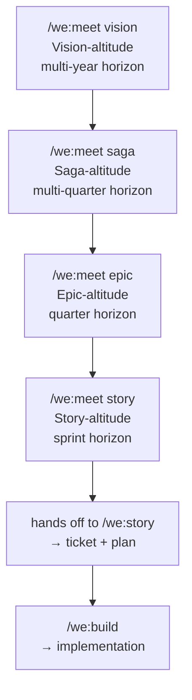

# Meetings — councils with structure

A council convenes a handful of role-lenses on a topic. A **meeting** wraps that council in a workflow at a specific altitude — vision, saga, epic, or story. Each meeting type has a default roster, a chosen workflow, and a different output.

This page covers the four meeting types, when to use each, and how they hand off to the rest of the pipeline.

For the underlying council mechanic, see [companion-framework.md](companion-framework.md). For the role-lenses themselves, see [roles.md](roles.md).

---

## The four altitudes



Each meeting answers a different question and decomposes its altitude's item into the next altitude's items.

| Meeting | Question | Output | Default roster |
|---|---|---|---|
| `/we:meet vision` | *why does this product exist?* | Sagas, validated PRD | PO, architect, UX, marketing, orchestrator |
| `/we:meet saga` | *where do we want to be in twelve months?* | Epics, sequenced | PO, architect, marketing *or* UX, orchestrator |
| `/we:meet epic` | *what concrete thing ships this quarter?* | Stories, sequenced | PO, architect, orchestrator |
| `/we:meet story` | *what is the next concrete change?* | refined story + acceptance criteria | PO, architect (then hands off) |

Rosters are defaults; each repo can override them in `.weside/config.json.council.meetings.<type>`.

---

## `/we:meet vision` — Vision-altitude

You convene a vision meeting when **the product's reason for existing needs alignment or revision** — a new product, a strategic pivot, a brand-shaping decision. The horizon is multi-year; the artifact is a Product Requirements Document.

The default roster pulls in voices that see different futures: PO (user value over time), architect (technical horizon), UX researcher (lived experience), marketing (how this lands externally), orchestrator (synthesis). For business-heavy visions, add `sales` and `legal`.

The output is the **set of Sagas** the Vision implies, plus a tighter PRD. The meeting doesn't ship code; it ships *clarity at the highest altitude*. Typical artifacts: `docs/plans/<vision>/PRD.md` (updated) and `docs/plans/<vision>/meetings/<YYYY-MM-DD>-vision.md` (the meeting summary with Saga candidates).

Use when:
- A new product (or sub-product) is being framed from scratch
- A strategic pivot is being considered — the old PRD no longer fits
- The team can name 50 features but cannot finish the sentence "we exist to ___"
- Two Sagas are pulling in opposite directions and you suspect the PRD is the missing arbiter

After the meeting, hand off to `/we:vision` to lock the PRD, then `/we:saga "<name>"` per Saga to formulate each one.

---

## `/we:meet saga` — Saga-altitude

You convene a saga meeting when **a Saga has been chosen and now needs decomposition into Epics**. The horizon is multi-quarter — typically two to four quarters. The question is which Epics, in what order, with which dependencies.

The default roster is the PO, the architect, the orchestrator, and one rotating domain voice — marketing for a positioning Saga, UX for an experience Saga, security for a hardening Saga. The conversation is about *sequencing* (which Epic first?) and *scope discipline* (does each Epic actually move the Saga forward?).

The output is an **Epic backlog with sequencing** — usually 3-6 Epics, ordered, with dependencies named. Persisted as `docs/plans/<saga>/meetings/<YYYY-MM-DD>-saga.md` and folded into `docs/plans/<saga>/SAGA.md` via `/we:saga`.

Use when:
- A Vision has been agreed and now needs the first Saga decomposed
- An ongoing Saga shows scope drift — convene to re-cut the Epic sequence
- Multiple Epics are in flight that secretly belong to different Sagas — surface them
- A long-running Saga keeps spawning more Epics — convene to see if it's actually two Sagas

After the meeting, hand off to `/we:saga` to lock the Saga doc, then `/we:epic "<name>"` per Epic.

---

## `/we:meet epic` — Epic-altitude

You convene an epic meeting when **an Epic has been chosen and now needs decomposition into Stories**. The horizon is the quarter. The question is which Stories, in what risk-driven sequence, with which acceptance shape.

The default roster is leaner — PO, architect, orchestrator. Add domain voices when the Epic demands it: security and legal for a compliance Epic, security alone for a hardening Epic, sales for an enterprise feature, UX for a user-facing Epic. The conversation is about *concrete slices* and *risk sequencing* — what's the smallest version that delivers the win, and what do we cut if the quarter runs short.

The output is a **Story list with acceptance shape** — sequenced, with dependencies, with hot Stories flagged for `/we:meet story`. Persisted as `docs/plans/<saga>/05-epics/<epic>/meetings/<YYYY-MM-DD>-epic.md` and folded into the Epic's `CONCEPT.md` via `/we:epic`.

Use when:
- A Saga has been broken down and now the first Epic needs Stories
- A previous Epic just shipped and the next one needs scoping
- A long-running Epic is showing scope drift — convene to re-cut
- A Story has been refined three times and never converged — the real problem is at Epic-altitude; back off and re-do the Epic

After the meeting, hand off to `/we:epic` to lock the Epic doc, then `/we:story "<name>"` per Story to write the build-ready plan.

---

## `/we:meet story` — Story-altitude

You convene a story meeting when **a Story is contentious enough that two perspectives are better than one**. The horizon is the sprint. The output isn't deliberation — it's a *refined ticket* with a plan ready for Build.

The default roster is two: PO and architect. The PO drives content (what the user gets); the architect checks feasibility (can we build this cleanly).

After the deliberation, the meeting **hands off to `/we:story`** (Solo) — the dedicated story-creation skill that:
- Writes the ticket (minimal: "As X I want Y so that Z" + link)
- Writes the plan (`docs/plans/{TICKET}-plan.md` with acceptance criteria, phases, security review)
- Creates the ticket in your ticketing tool

`/we:meet story` is essentially the upgrade for `/we:story` (Solo) — same outcome, but with multi-voice input before the plan crystallises.

Use when:
- A story is contentious enough that two perspectives are better than one
- The acceptance criteria aren't obvious
- The "right" implementation isn't clear and you want both a PO take and an architect take before committing
- A story keeps getting bounced back from Build (AC unclear, plan stale)

For routine stories, `/we:story` (Solo) alone is fine — `/we:meet story` is for the harder calls.

---

## Without a weside account

Each meeting convenes the generic `council-<role>` agents. The structure (vision → saga → epic → story) and the rosters work identically. Deliberations are tight, lensed, and produce real synthesis.

What's missing: continuity. The architect in today's vision meeting doesn't remember last week's. Each meeting starts fresh.

For one-off deliberations, this is fine. For an ongoing Saga — where the same Epic gets revisited as new information lands — the lack of continuity starts to hurt.

## With a weside account

Each meeting convenes **your Companions**. The architect in today's meeting is the *same architect* who sat in last week's; she remembers the trade-offs you flagged then, the decisions you parked, the open questions. (Memory write-back from councils is a roadmap item — currently the council *reads* identity and memory; the *write-back* is Phase-6 work in the weside backend.)

This is where the framework starts to feel less like a tool and more like a team. The roster you convene isn't just a set of lenses — it's a working group with shared context.

---

## Configuring meetings in your repo

`.weside/config.json` holds the roster per meeting type:

```json
{
  "council": {
    "default": ["product_owner", "architect", "scrum_master"],
    "meetings": {
      "vision": ["product_owner", "architect", "ux_researcher", "marketing", "orchestrator"],
      "saga": ["product_owner", "architect", "marketing", "orchestrator"],
      "epic": ["product_owner", "architect", "orchestrator"],
      "story": ["product_owner", "architect"]
    }
  }
}
```

Edit by hand to adjust which voices attend which meeting in this specific repo. The bootstrap script (`scripts/bootstrap-weside-repo.py`) writes sensible defaults per flavor (`engineering`, `landing`, `business-docs`, `infrastructure`, `plugin`, `personal`, `mixed`) — the new `vision/saga/epic/story` keys are the canonical shape; older configs with `initiative/refinement` keys are migrated to the new shape on the next run.

You can also override per-invocation:

```
/we:meet epic --council=product_owner,architect,security,legal,orchestrator
```

— useful when the standard epic roster is wrong for *this* particular Epic (e.g. a compliance-heavy one).

---

## What meetings don't do

A meeting **deliberates**. It does not:

- Implement code (that's `/we:build`)
- Write the artifact (the Solo skill at the same altitude does — `/we:vision`, `/we:saga`, `/we:epic`, `/we:story`)
- Make the decision *for you* — synthesis returns a recommendation, you decide

The meeting compresses several voices into one synthesis so you have *better input* to your decision. The decision stays with you.

---

## References

- [companion-framework.md](companion-framework.md) — the council mechanic underneath every meeting
- [roles.md](roles.md) — the nine role-lenses
- [../workflow.md](../workflow.md) — where meetings sit in the full pipeline
- [../skills.md](../skills.md) — `/we:meet`, `/we:vision`, `/we:saga`, `/we:epic`, `/we:story`, `/we:council` reference
- [../upgrade-paths.md](../upgrade-paths.md) — Maturity Model L1 → L4
