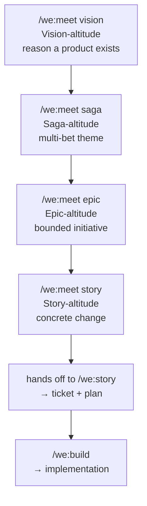

# Meetings — councils with structure

A council convenes a handful of role-lenses on a topic. A **meeting** wraps that council in a workflow at a specific altitude — vision, saga, epic, or story. Each meeting type has a default roster, a chosen workflow, and a different output.

This page covers the four meeting types, when to use each, and how they hand off to the rest of the pipeline.

For the underlying council mechanic, see [companion-framework.md](companion-framework.md). For the role-lenses themselves, see [roles.md](roles.md).

---

## The four altitudes



Each meeting answers a different question and decomposes its altitude's item into the next altitude's items.

Below Story sits **Build**, where deliberation gives way to dispatch. `/we:orchestrate` is the Build-altitude sibling of the council: instead of convening role-lenses to deliberate, it dispatches **dev-only `/we:develop` workers** (one per ready Story, or one per phase of a single Story), then the Lead merges their branches onto one integration branch, opens **one PR**, and runs **CI once**.

| Meeting | Question | Output | Default roster |
|---|---|---|---|
| `/we:meet vision` | *why does this product exist?* | Sagas, validated PRD | PO, architect, UX, marketing, orchestrator |
| `/we:meet saga` | *what bet are we pointing energy at?* | Epics, sequenced | PO, architect, marketing, orchestrator |
| `/we:meet epic` | *what concrete thing ships next?* | Stories, sequenced | PO, architect, orchestrator |
| `/we:meet story` | *what is the next concrete change?* | refined story + acceptance criteria | PO, architect (then hands off) |

The four altitudes used to carry time labels (multi-year / multi-quarter / quarter / sprint). The labels are dropped because implementer speed varies wildly — calendar windows are unreliable when an AI partner can ship a Story in hours that a human estimated as a week. Size by *bet shape* (does it have an end, does it ship a coherent change) not by stopwatch. The Solo Plan skills enforce this with soft warnings, never hard blocks.

Rosters are defaults; each repo can override them in `.weside/config.json.council.meetings.<type>`.

### How plan artifacts are named, stored, and mapped to ticketing

The plan tree under `docs/plans/` is **flat for Saga-and-below** — no separate index
file. The **filename suffix** is the altitude marker; the **saga-slug prefix** is the
grouping. The slug (e.g. `presence`) is the human-memorable key — you never have to
remember a ticket number to find a Saga. The one exception is the **Vision**, which owns
a nested `docs/plans/<vision>/` directory (the PRD plus optional `research/`).

| Altitude | Filename | In ticketing? |
|---|---|---|
| Vision | `docs/plans/<vision>/PRD.md` | No (Markdown-only) |
| Saga | `docs/plans/<saga>-saga.md` | **No** — Sagas never get a ticket |
| Epic | `docs/plans/<saga>-<epic>-epic.md` | Optional ticketing Epic, titled `[<saga>] <Epic Title>` |
| Story | `docs/plans/<TICKET>-story.md` | Required ticket; parent = the Epic |

- **Iteration without an index:** `ls docs/plans/*-saga.md` lists every Saga;
  `*-epic.md` every Epic; `*-story.md` every Story. `ls docs/plans/<saga>-*` shows one
  Saga and all its Epics grouped together — that glob is a built-in mini-dashboard
  (`/we:map` renders the full tree on top of it).
- **Linkage lives in frontmatter:** a Story's `epic:` field points to its parent Epic;
  an Epic's `saga:` field + filename prefix point to its parent Saga.
- **The Jira gap:** most ticketing tools have only Epic→Story, no Saga level. The Saga
  is therefore expressed two ways only — the `<saga>-saga.md` Markdown file, and the
  `[<saga>]` bracket-prefix on each child Epic's title. To see one Saga's Epics in Jira:
  `summary ~ "[<saga>]"`. There is deliberately **no `.weside` saga index** — the
  filename suffix + the title prefix carry everything, so nothing can drift out of sync.
- **Brownfield promotion:** if a ticketing Epic has quietly grown into a Saga (many
  Stories, multiple themes, no landing), `/we:saga promote <EPIC-KEY>` cuts it into
  Epics and emits a re-parenting plan. The `/we:epic` Status dashboard surfaces the same
  "this Epic is becoming a Saga" signal so the drift gets caught in the 90%-path.

---

## `/we:meet vision` — Vision-altitude

You convene a vision meeting when **the product's reason for existing needs alignment or revision** — a new product, a strategic pivot, a brand-shaping decision. The artifact is a Product Requirements Document.

The default roster pulls in voices that see different futures: PO (user value over time), architect (technical horizon), UX researcher (lived experience), marketing (how this lands externally), orchestrator (synthesis). For business-heavy visions, add `sales` and `legal`.

The output is the **set of Sagas** the Vision implies, plus a tighter PRD. The meeting doesn't ship code; it ships *clarity at the highest altitude*. Typical artifacts: `docs/plans/<vision>/PRD.md` (updated) and `docs/plans/<vision>-vision-meeting-<YYYY-MM-DD>.md` (the meeting summary with Saga candidates).

Use when:
- A new product (or sub-product) is being framed from scratch
- A strategic pivot is being considered — the old PRD no longer fits
- The team can name 50 features but cannot finish the sentence "we exist to ___"
- Two Sagas are pulling in opposite directions and you suspect the PRD is the missing arbiter

After the meeting, hand off to `/we:vision` to lock the PRD, then `/we:saga "<name>"` per Saga to formulate each one.

---

## `/we:meet saga` — Saga-altitude

You convene a saga meeting when **a Saga has been chosen and now needs decomposition into Epics**. The question is which Epics, in what order, with which dependencies.

The default roster is the PO, the architect, marketing, and the orchestrator. The conversation is about *sequencing* (which Epic first?) and *scope discipline* (does each Epic actually move the Saga forward?). Domain voices vary by Saga type — repos focused on UX or security typically override the marketing slot in `.weside/config.json.council.meetings.saga`; the shipped default assumes a positioning-heavy Saga.

The output is an **Epic backlog with sequencing** — usually 3-6 Epics, ordered, with dependencies named. Persisted as `docs/plans/<saga>-saga-meeting-<YYYY-MM-DD>.md` and folded into `docs/plans/<saga>-saga.md` via `/we:saga`.

Use when:
- A Vision has been agreed and now needs the first Saga decomposed
- An ongoing Saga shows scope drift — convene to re-cut the Epic sequence
- Multiple Epics are in flight that secretly belong to different Sagas — surface them
- A long-running Saga keeps spawning more Epics — convene to see if it's actually two Sagas

After the meeting, hand off to `/we:saga` to lock the Saga doc, then `/we:epic "<name>"` per Epic.

---

## `/we:meet epic` — Epic-altitude

You convene an epic meeting when **an Epic has been chosen and now needs decomposition into Stories**. The question is which Stories, in what risk-driven sequence, with which acceptance shape.

The default roster is leaner — PO, architect, orchestrator. Add domain voices when the Epic demands it: security and legal for a compliance Epic, security alone for a hardening Epic, sales for an enterprise feature, UX for a user-facing Epic. The conversation is about *concrete slices* and *risk sequencing* — what's the smallest version that delivers the win, and what do we cut if the slice runs long.

The output is a **Story list with acceptance shape** — sequenced, with dependencies, with hot Stories flagged for `/we:meet story`. Persisted as `docs/plans/<saga>-<epic>-epic-meeting-<YYYY-MM-DD>.md` and folded into `docs/plans/<saga>-<epic>-epic.md` via `/we:epic`.

Use when:
- A Saga has been broken down and now the first Epic needs Stories
- A previous Epic just shipped and the next one needs scoping
- A long-running Epic is showing scope drift — convene to re-cut
- A Story has been refined three times and never converged — the real problem is at Epic-altitude; back off and re-do the Epic

After the meeting, hand off to `/we:epic` to lock the Epic doc, then `/we:story "<name>"` per Story to write the build-ready plan.

---

## `/we:meet story` — Story-altitude

You convene a story meeting when **a Story is contentious enough that two perspectives are better than one**. The output isn't deliberation — it's a *refined ticket* with a plan ready for Build.

The default roster is two: PO and architect. The PO drives content (what the user gets); the architect checks feasibility (can we build this cleanly).

After the deliberation, the meeting **hands off to `/we:story`** (Solo) — the dedicated story-creation skill that:
- Writes the ticket (minimal: "As X I want Y so that Z" + link)
- Writes the plan (`docs/plans/{TICKET}-story.md` with acceptance criteria, phases, security review)
- Creates the ticket in your ticketing tool

`/we:meet story` is essentially the upgrade for `/we:story` (Solo) — same outcome, but with multi-voice input before the plan crystallises.

Use when:
- A story is contentious enough that two perspectives are better than one
- The acceptance criteria aren't obvious
- The "right" implementation isn't clear and you want both a PO take and an architect take before committing
- A story keeps getting bounced back from Build (AC unclear, plan stale)

For routine stories, `/we:story` (Solo) alone is fine — `/we:meet story` is for the harder calls.

---

## Without a weside account

Each meeting convenes the generic `council-<role>` agents. The structure (vision → saga → epic → story) and the rosters work identically. Deliberations are tight, lensed, and produce real synthesis.

What's missing: continuity. The architect in today's vision meeting doesn't remember last week's. Each meeting starts fresh.

For one-off deliberations, this is fine. For an ongoing Saga — where the same Epic gets revisited as new information lands — the lack of continuity starts to hurt.

## With a weside account

Each weside-backed seat is filled by **one of your Companions**. The architect in today's meeting is the *same architect* who sat in last week's; she remembers the trade-offs you flagged then, the decisions you parked, the open questions. (Memory write-back from councils is a roadmap item — currently the council *reads* identity and memory; the *write-back* is Phase-6 work in the weside backend.) A meeting roster is usually **mixed** — the key roles backed by Companions, the rest running the generic lens — and `loadCouncilFromWeside: false` can force every seat back to generic for a fast, free deliberation.

This is where the framework starts to feel less like a tool and more like a team. The roster you convene isn't just a set of lenses — it's a working group with shared context.

---

## How a council actually runs — the live-team mechanic

Every council convenes its members as a **live Claude Code Agent Team**: one teammate per role, each in its own session, sharing a team channel. Members address each other directly (`SendMessage(to="architect", message="…")`), so the architect actually hears the PO's concern and can respond to it — instead of writing parallel memos in isolation.

Each teammate's voice is either **generic** (the shipped `council-<role>` agent) or **weside-backed** (the Companion the bridge links for that role), decided per role by the `loadCouncilFromWeside` toggle. `/we:meet` inherits that setting from `/we:council` — see [companion-framework.md](companion-framework.md#the-loadcouncilfromweside-toggle).

The **lead session** — the one that ran `/we:council` or `/we:meet` — is the orchestrator. It does not speak as a member; it observes the chatter, closes the deliberation when it is ripe (idle quiescence, or a hard message-/time-cap), then asks each member for a final position and writes the synthesis (`Council Perspectives → Agreement → Tension → Recommendation`). If the lead is a materialised weside Companion, the synthesis is in that Companion's voice; otherwise it uses the shipped template.

### Prerequisites

Live councils require Claude Code's experimental Agent Teams feature. Set in `~/.claude/settings.json`:

```json
{ "env": { "CLAUDE_CODE_EXPERIMENTAL_AGENT_TEAMS": "1" } }
```

A session restart is needed after toggling the flag. `/we:setup` (Step 5.0) will set it on request. Without the flag, `/we:council` aborts with a remediation hint — there is no fallback to the older parallel-memo path.

---

## Configuring meetings in your repo

`.weside/config.json` holds the roster per meeting type:

```json
{
  "council": {
    "default": ["product_owner", "architect", "scrum_master"],
    "meetings": {
      "vision": ["product_owner", "architect", "ux_researcher", "marketing", "orchestrator"],
      "saga": ["product_owner", "architect", "marketing", "orchestrator"],
      "epic": ["product_owner", "architect", "orchestrator"],
      "story": ["product_owner", "architect"]
    }
  }
}
```

Edit by hand to adjust which voices attend which meeting in this specific repo. The bootstrap script (`scripts/bootstrap-weside-repo.py`) writes sensible defaults per flavor (`engineering`, `landing`, `business-docs`, `infrastructure`, `plugin`, `personal`, `mixed`) — the `vision/saga/epic/story` keys are the canonical shape.

You can also override per-invocation:

```
/we:meet epic --council=product_owner,architect,security,legal,orchestrator
```

— useful when the standard epic roster is wrong for *this* particular Epic (e.g. a compliance-heavy one).

---

## What meetings don't do

A meeting **deliberates**. It does not:

- Implement code (that's `/we:build`)
- Write the artifact (the Solo skill at the same altitude does — `/we:vision`, `/we:saga`, `/we:epic`, `/we:story`)
- Make the decision *for you* — synthesis returns a recommendation, you decide

The meeting compresses several voices into one synthesis so you have *better input* to your decision. The decision stays with you.

---

## What the plugin does NOT do at sprint boundaries

The four-altitude planning pipeline covers *what to build and why*. It deliberately stays out of sprint-boundary ceremony mechanics:

| NOT handled by the plugin | Use instead |
|---|---|
| Daily stand-up facilitation | Your team's process / Scrum tooling |
| Velocity tracking and burndown | Your project management tool (Jira, GitHub Projects) |
| Sprint demo preparation | Your own notes or meeting tool |
| Backlog grooming in bulk | Individual `/we:story` calls as stories mature |
| Sprint retrospectives as ceremony | `/we:retro` (post-PR, not post-sprint) |

`/we:retro` analyses *engineering* friction from a merged PR cycle, not the team-dynamics retrospective a Scrum Master facilitates at sprint end. Both have their place; they are not the same thing.

---

## References

- [how-we-work.md](how-we-work.md) — the canonical method manifest `/we:coach` + `/we:retro` load at boot
- [companion-framework.md](companion-framework.md) — the council mechanic underneath every meeting
- [roles.md](roles.md) — the nine role-lenses
- [../workflow.md](../workflow.md) — where meetings sit in the full pipeline
- [../skills.md](../skills.md) — `/we:meet`, `/we:vision`, `/we:saga`, `/we:epic`, `/we:story`, `/we:council` reference
- [../upgrade-paths.md](../upgrade-paths.md) — Maturity Model L1 → L4
