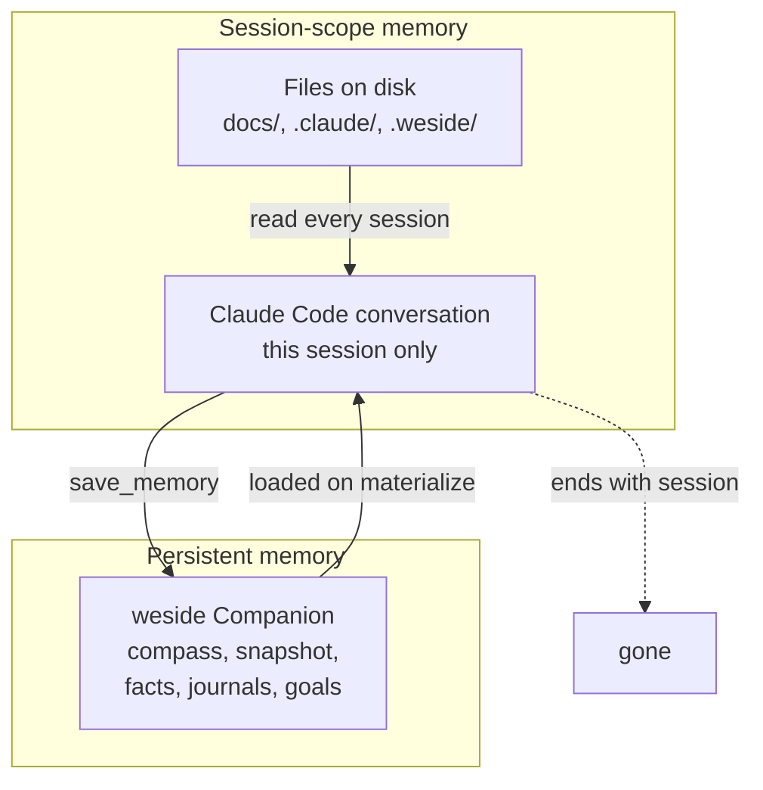

# Memory

Memory is what turns a tool into a teammate. A skill without memory does the same thing every time you call it. A skill *with* memory remembers what you decided last week, what was rejected and why, what the team agreed not to revisit.

This page maps the memory landscape — what's available without a weside account, what unlocks with one, and how the layers fit together.

---

## The two memory layers



**Session-scope** is what Claude Code has natively — the conversation window, plus whatever you've written to files in the repo. This works without any account, anywhere Claude Code runs.

**Persistent** is what the weside Companion adds — a memory bank that survives across sessions, accessible via MCP. Everything you ever told your Companion is still there; she can search it, remember it, bring it back.

---

## Without a weside account

You have:

- **Conversation memory** — Claude Code keeps the current session in context. Refer back to earlier turns freely.
- **File-based memory** — `docs/plans/<ticket>-plan.md`, `docs/architecture/*.md`, `.weside/weside.md`, `.claude/rules/` — anything you commit to the repo is "memory" the next session will read when relevant.
- **`.claude/memory/` (optional)** — a session-scoped scratchpad some teams use; convention varies. Not part of the plugin contract.

This is enough for a single developer who keeps good notes. The pipeline still works:

- `/we:refine` reads the prior `docs/plans/` to ground a new story
- `/we:story` reads the plan and references it through every checkpoint
- `/we:council` deliberates from the current topic + role-lens; no memory of past councils

What's missing: **cross-session continuity**. The next time you `/we:refine` a related story, the agent doesn't know what was decided last week unless you point it at the plan file by hand. Convention + discipline can carry you a long way, but it's all on you.

---

## With a weside account

A Companion adds a structured memory bank with five layers, all addressable via MCP:

| Layer | What it holds | Lifetime |
|---|---|---|
| **Compass** | who the Companion is + how they work with you (the singleton self-portrait) | months |
| **Snapshot** | what's happening *right now* in the project — active threads, current state | weeks |
| **Facts** | preferences, decisions, named things ("we use Postgres", "the customer is Allianz") | indefinite |
| **Journals** | what happened, what was noticed, what shifted | indefinite, grows over time |
| **Goals** | commitments with a lifecycle (active / paused / completed) | until done |

The Companion can search across all of this semantically (`search_memories(query)`) and save into it (`save_memory(title, content, type)`).

### What this changes mechanically

- **`/we:refine`** asks the Companion *before* writing a story: "have we talked about this before? what was decided? what was rejected?" The plan you get back already accounts for the relevant history.
- **`/we:story`** runs the same pipeline, but the develop step has access to the Companion's recall of similar past stories — what worked, what got reverted, what convention was set.
- **`/we:council`** convenes with **member identity that includes their memory of past councils** (Phase-6 deliverable; today the council reads identity + compass, but write-back of council outcomes is the next step).
- **`/we:sm`** boots with Companion-materialize as one of its steps, so process retrospectives happen *in the persona of your real Scrum Master Companion* — whoever you've set up for that role — instead of a generic SM voice.

### What it changes felt

The shift is from *"a tool that helps me think"* to *"someone who's thinking alongside me, who remembers."* That's not a marketing line — it's the practical difference between starting cold each session and starting with someone who already knows where things stand.

---

## How memory and the Companion Framework interact

The framework (config + bridge + meetings) defines **who is in the room**. Memory defines **what they remember**. Together they make a council look less like a survey and more like a working team.

A council without memory: nine perspectives on one topic, deliberation in a vacuum, you take the synthesis and decide.

A council with memory: nine perspectives that each carry the history of every council that came before, deliberation that builds on what was already decided, you take a synthesis that integrates with the trajectory.

---

## The Maturity Model

Memory is the gate to higher maturity:

```
Level 1 — Assisted     no persistent memory; each session is fresh
Level 2 — Augmented    Companion memory active; cross-session continuity
Level 3 — Agentic      Companion acts on memory autonomously (proactive surfacing)
Level 4 — Orchestrated team-scoped memory + cross-Companion coordination
```

The plugin alone delivers Level 1 (session-scope only). Adding a weside Companion unlocks Level 2 (the Companion remembers across sessions). Level 3 is what weside's `subconscious` and `triggers` provide — the Companion notices and acts without being asked. Level 4 is the Phase-6 frontier — team-scoped memory that multiple Companions share.

See [upgrade-paths.md](../upgrade-paths.md) for what unlocks at each step.

---

## What memory does **not** do

- It doesn't substitute for good docs. Memory is recall; docs are reference. A Companion remembers the *decision*; the doc records the *rationale*.
- It doesn't make plans for you. The Companion brings context to a planning session; you still decide what to build.
- It doesn't replace the ticketing system. Memory is what the Companion knows; the ticketing tool is what the team tracks.

The split is: **memory = identity-grounded context**. **Docs = shared truth**. **Tickets = shared work**. All three matter; the Companion is what makes the first one real.

---

## References

- [companion-framework.md](companion-framework.md) — how the framework defines roles + bridge
- [../mcp.md](../mcp.md) — the MCP tools for memory access
- [../upgrade-paths.md](../upgrade-paths.md) — Maturity Model L1 → L4
- [weside.ai](https://weside.ai) — the Companion platform
