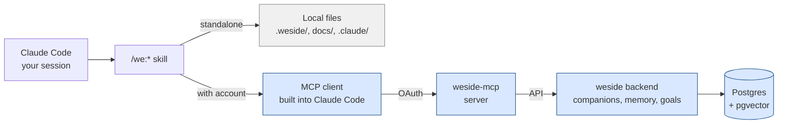

# The MCP Layer

The Model Context Protocol (MCP) is how Claude Code talks to external systems — read documents, execute tools, fetch state from services. The plugin uses MCP to (optionally) connect to the [weside.ai](https://weside.ai) backend so your Companion's identity and memory are available in every session.

The MCP layer is **strictly additive**. Without it, the plugin runs all its skills standalone. With it, the same skills become Companion-aware.

This page covers the MCP architecture, the tools the plugin exposes, and how the with/without-account split actually works.

For the upgrade journey itself, see [upgrade-paths.md](upgrade-paths.md). For the Companion Framework that consumes MCP, see [concepts/companion-framework.md](concepts/companion-framework.md).

---

## Architecture



The plugin bundles a `we/.mcp.json` that points Claude Code at the `weside-mcp` server. The server lives at the weside backend and authenticates the user via OAuth on first connect. Once authenticated, MCP tools become available in the Claude Code session — `list_companions`, `get_companion_identity`, `search_memories`, `get_council`, and so on.

**Without a weside account**, the MCP tools are absent from the tool list. The plugin's skills detect this and fall through to standalone paths.

**With a weside account**, the tools appear, and the framework skills use them automatically.

---

## What the MCP layer adds

| Capability | Standalone | With MCP |
|---|---|---|
| Companion identity | none — generic role agents | full persona, voice, color |
| Memory | session-only; what you wrote in files | persistent across sessions, semantic search |
| Goals | none | active / paused / completed lifecycle |
| Provider config | one-size-fits-all | per-Companion LLM provider preset |
| Cross-session continuity | manual (read your own notes) | automatic (Companion remembers) |

---

## The MCP tools

These appear in the Claude Code session when the weside MCP is connected. The plugin's skills call them when present.

### Identity + companions

| Tool | Purpose |
|---|---|
| `list_companions()` | List your available companions with short descriptions and `identity_updated_at` |
| `select_companion(name)` | Switch the active companion for this session |
| `get_companion_identity()` | Load the active companion's full composed prompt (~5K tokens via MCP delivery target) |
| `get_council(names?, workspace_id?)` | Batch-load council projections for the user's companions — used by `/we:council` |
| `materialize` (Skill) | Wrapper around the above that the plugin uses to adopt a Companion at session start |

### Memory

| Tool | Purpose |
|---|---|
| `search_memories(query, memory_type?, limit?)` | Semantic search across the Companion's memory |
| `save_memory(title, content, type, tags?)` | Save a new memory of the given type (fact, journal, highlight, experience, plan, todo) |
| `list_memories(memory_type?, limit?, autoload?)` | Browse with filters, sorted by date |
| `store_conversations(items)` | Batch-store conversation turns as memories (WA-695) |

### Goals

| Tool | Purpose |
|---|---|
| `list_goals(status?)` | Browse goals by lifecycle state |
| `save_goal(title, content, tags?)` | Create or update a goal |
| `update_goal_status(title, status)` | Move active → paused → completed |
| `update_goal(...)` | Adjust due dates, follow-up dates, content |

### Threads

| Tool | Purpose |
|---|---|
| `list_threads(limit?)` | List the Companion's conversation threads |
| `show_thread(thread_id)` | Show messages in a thread |
| `delete_thread(thread_id)` | Delete a thread |

### Provider config

| Tool | Purpose |
|---|---|
| `show_provider()` | Current LLM provider config (model, region) |
| `list_provider_presets()` | Available regional presets (EU, US, etc.) |
| `set_provider(preset_id)` | Switch the Companion's LLM provider preset |

### External tools (Composio)

| Tool | Purpose |
|---|---|
| `discover_tools(category?, service?)` | List the external tools available via the Companion's integrations |
| `execute_tool(name, arguments)` | Execute an external tool (Jira, Slack, GitHub, etc.) |
| `get_tool_schema(name)` | Inspect a tool's parameters |

The Composio layer is what lets a Companion send a Slack message, create a Jira ticket, or post to LinkedIn — extensions to the Companion's reach beyond what the plugin alone provides.

---

## Without a weside account

The plugin's skills detect MCP absence and fall through cleanly. Specifically:

- **`/we:council`** — uses the nine shipped `council-<role>` generic agents. Same mechanic, generic voices.
- **`/we:meet`** — same as above, structured workflow with generic voices.
- **`/we:sm`**, **`/we:arch`** — boot without Companion identity; reason from rules + skill landscape.
- **`/we:setup`**, **`/we:onboarding`** — write `.weside/` files with `Companion ID: null`; the bridge is filled with structure but no live linkage.
- **`/we:sideload`** — degrades to legacy mode (reads CLAUDE.md + always-loaded rules; skips vault step).
- **`/we:refine`**, **`/we:story`** — pipeline runs unchanged. No memory grounding, but full pipeline.

You lose continuity and personality. You don't lose any feature.

---

## With a weside account

Get an account at [weside.ai](https://weside.ai). Create at least one Companion (the platform onboards you). Then in Claude Code:

```
/plugin settings we@weside-ai
```

Set:
- **`companion`** — the name of the Companion you want to use in Claude Code
- **`autoMaterialize`** — true to auto-load at session start (or false, and call `/we:materialize` manually)

First MCP call triggers an OAuth flow in your browser. Confirm, and you're connected.

Then in your project:

```
/we:setup    # if you haven't already
/we:onboarding   # compose the crew, this time with real Companion IDs
```

The bridge file (`.weside/council.json`) gets populated with your real crew. From here, every `/we:council` and `/we:meet` runs with their voices.

---

## The `get_council` contract

`get_council` is the MCP method that powers multi-Companion deliberation in the plugin. Worth knowing if you're integrating or debugging.

**Signature:**

```python
get_council(
    names: list[str] | None = None,
    workspace_id: str | None = None,
) -> str  # JSON
```

**Behavior (v1, current):**
- Returns the calling user's Companions (or just those named, case-insensitive)
- Each entry: `{name, identity_prompt, identity_updated_at}`
- `workspace_id` is reserved for future team-scoping; currently accepted and ignored
- Per-call cap: 200 companions (more than typical crews; documented in the docstring)
- One bad apple doesn't spoil the batch — exceptions per Companion are logged and skipped

**Used by:** `/we:council`, `/we:meet`. The plugin pairs the returned identities with the bridge file's role/color mapping (see [companion-framework.md](concepts/companion-framework.md)).

**Privacy caveat for v1:** the `identity_prompt` is the MCP-delivery composed prompt (~5K tokens) — it may include Compass / Snapshot / personal memory layers. Safe for the user's own crew in their own Claude Code session. **Not safe** for cross-user/cross-org exposure without the Phase-6 team-scoping work (tracked as WA-1087 in the weside backend).

---

## What MCP is *not*

- **Not a substitute for ticket tracking.** Jira / GitHub Issues stay where they are; MCP doesn't replace them.
- **Not a remote control for the Companion.** The Companion lives at weside; MCP is the API surface, not an instruction channel.
- **Not required for any single skill to function.** Every skill works without it, just with reduced richness.

---

## References

- [concepts/companion-framework.md](concepts/companion-framework.md) — how `/we:council` consumes MCP
- [concepts/memory.md](concepts/memory.md) — what the memory tools enable
- [upgrade-paths.md](upgrade-paths.md) — the Maturity Model in detail
- [weside.ai](https://weside.ai) — the platform itself
- [agenticproductownership.com](https://agenticproductownership.com) — the philosophy
