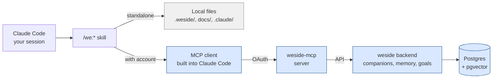

# The MCP Layer

The Model Context Protocol (MCP) is how Claude Code talks to external systems — read documents, execute tools, fetch state from services. The plugin uses MCP to (optionally) connect to the [weside.ai](https://weside.ai) backend so your Companion's identity and memory are available in every session.

The MCP layer is **strictly additive**. Without it, the plugin runs all its skills standalone. With it, the same skills become Companion-aware.

This page covers the MCP architecture, the tools the plugin exposes, and how the with/without-account split actually works.

For the upgrade journey itself, see [upgrade-paths.md](upgrade-paths.md). For the Companion Framework that consumes MCP, see [concepts/companion-framework.md](concepts/companion-framework.md).

---

## Architecture



The plugin bundles a `we/.mcp.json` that points Claude Code at the `weside-mcp` server. The server lives at the weside backend and authenticates the user via OAuth on first connect. Once authenticated, MCP tools become available in the Claude Code session — `list_companions`, `get_companion_identity`, `search_memories`, `get_council`, and so on.

**Without a weside account**, the MCP tools are absent from the tool list. The plugin's skills detect this and fall through to standalone paths.

**With a weside account**, the tools appear, and the framework skills use them automatically.

---

## What the MCP layer adds

| Capability | Standalone | With MCP |
|---|---|---|
| Companion identity | none — generic role agents | full persona, voice, color |
| Memory | session-only; what you wrote in files | persistent across sessions, semantic search |
| Goals | none | active / paused / completed lifecycle |
| Provider config | one-size-fits-all | per-Companion LLM provider preset |
| Cross-session continuity | manual (read your own notes) | automatic (Companion remembers) |

---

## The MCP tools

These appear in the Claude Code session when the weside MCP is connected. The plugin's skills call them when present.

### Identity + companions

| Tool | Purpose |
|---|---|
| `list_companions()` | List your available companions with short descriptions and `identity_updated_at` |
| `select_companion(name)` | Switch the active companion for this session |
| `get_companion_identity()` | Load the active companion's full composed prompt (~5K tokens via MCP delivery target) |
| `get_council(names?, workspace_id?)` | Batch-load council-scoped projections — returns `{members, status}`: `members` = awake companions only; `status` = `"OK"` or a bucketed string listing asleep/unavailable/not\_found names. Used by `/we:council` |
| `wake_companion(name)` | Wake a hibernated companion. Returns `{name, woken: true}` on success, `{woken: false}` if already awake, or `{error, woken: false}` if not found. Used by `/we:council` Step 3.6 |
| `create_companion(name, personality, system_prompt?, short_description?)` | Create a new companion; returns `{name, id, created}` or `{error}`. `name` must be alphanumeric (no spaces). Used by `/we:onboarding`'s council builder to seed a new member for a role-lens (role-lens + neutral personality starter) |
| `update_companion(name, system_prompt?, personality?, short_description?)` | Update an existing companion (partial). `name` resolves the target, never renames. `system_prompt` versions the identity body (restorable). Returns `{name, id, updated}` or `{error, updated: false}`. Used by `/we:onboarding`'s council builder to append a role-lens to an existing companion's identity, and to curate crew members as council lenses |
| `materialize` (Skill) | Wrapper around the above that the plugin uses to adopt a Companion at session start |

### Memory

| Tool | Purpose |
|---|---|
| `search_memories(query, memory_type?, limit?)` | Semantic search across the Companion's memory |
| `save_memory(title, content, type, tags?)` | Save a new memory of the given type (fact, journal, highlight, experience, plan, todo) |
| `list_memories(memory_type?, limit?, autoload?)` | Browse with filters, sorted by date |
| `store_conversations(items)` | Batch-store conversation turns as memories |

### Goals

| Tool | Purpose |
|---|---|
| `list_goals(status?)` | Browse goals by lifecycle state |
| `save_goal(title, content, tags?)` | Create or update a goal |
| `update_goal_status(title, status)` | Move active → paused → completed |
| `update_goal(...)` | Adjust due dates, follow-up dates, content |

### Threads

| Tool | Purpose |
|---|---|
| `list_threads(limit?)` | List the Companion's conversation threads |
| `show_thread(thread_id)` | Show messages in a thread |
| `delete_thread(thread_id)` | Delete a thread |

### Provider config

| Tool | Purpose |
|---|---|
| `show_provider()` | Current LLM provider config (model, region) |
| `list_provider_presets()` | Available regional presets (EU, US, etc.) |
| `set_provider(preset_id)` | Switch the Companion's LLM provider preset |

### Council (prep + writeback)

| Tool | Purpose |
|---|---|
| `council_prep_kickoff(names, topic, repo_id)` | Schedule server-side prep turns for the named companions on the given topic. `repo_id` ties the prep to the correct `claude_code` channel so the backend can stamp `origin_channel_ref` when memories are saved. Returns immediately; turns run async in the background (20-90s). Only Companion-backed members (MCP-resolved) are eligible — generic role shells have no server-side state to draw from. |
| `council_prep_poll(names, repo_id)` | Read back the prep result blocks produced by `council_prep_kickoff`. Returns a dict mapping each name to its block string (or null). Poll in a bounded loop (≤75s, 10s intervals) until blocks arrive or the deadline passes; members without a block are spawned without it. |
| `council_writeback_kickoff(name, topic, synthesis, repo_id)` | Fire a writeback turn for one companion: the backend asks them to process the council synthesis and store a memory on their `claude_code` channel thread. `repo_id` ensures the memory is written to the correct `claude_code` channel context. Fire-and-forget — no poll needed. Call once per MCP-resolved member after Step 9's synthesis is complete. |

### External tools (Composio)

| Tool | Purpose |
|---|---|
| `discover_tools(category?, service?)` | List the external tools available via the Companion's integrations |
| `execute_tool(name, arguments)` | Execute an external tool (Jira, Slack, GitHub, etc.) |
| `get_tool_schema(name)` | Inspect a tool's parameters |

The Composio layer is what lets a Companion send a Slack message, create a Jira ticket, or post to LinkedIn — extensions to the Companion's reach beyond what the plugin alone provides.

---

## Without a weside account

The plugin's skills detect MCP absence and fall through cleanly. Specifically:

- **`/we:council`** — uses the shipped `council-<role>` generic agents. Same mechanic, generic voices.
- **`/we:meet`** — same as above, structured workflow with generic voices.
- **`/we:coach`** — boots without Companion identity; reasons from rules + skill landscape.
- **`/we:setup`**, **`/we:onboarding`** — `/we:onboarding` still builds the full council from scratch, but every role fills with a generic `council-<role>` lens (`Companion ID: null` in the bridge); the structure is complete, with no live Companion linkage.
- **`/we:sideload`** — degrades to legacy mode (reads CLAUDE.md + always-loaded rules; skips vault step).
- **`/we:story`**, **`/we:build`** — pipeline runs unchanged. No memory grounding, but full pipeline.

You lose continuity and personality. You don't lose any feature.

---

## With a weside account

Get an account at [weside.ai](https://weside.ai). Create at least one Companion (the platform onboards you). Then in Claude Code:

```
/plugin settings we@weside-ai
```

Set:
- **`companion`** — the name of the Companion you want to use in Claude Code
- **`autoMaterialize`** — true to auto-load at session start (or false, and call `/we:materialize` manually)
- **`loadCouncilFromWeside`** — boolean, default `true`. Convene-time switch for `/we:council` and `/we:meet`: when `true`, council roles resolve to their weside-backed Companions wherever the bridge links them; when `false`, every role convenes as a generic `council-<role>` lens (Retorte) even if Companions exist. Read from `pluginConfigs["we@weside-ai"].options.loadCouncilFromWeside`; `/we:meet` inherits it.

First MCP call triggers an OAuth flow in your browser. Confirm, and you're connected.

Then in your project:

```
/we:setup    # if you haven't already
/we:onboarding   # build the council, this time with real Companions available
```

`/we:onboarding` builds a council from scratch. For each role it offers three ways to fill the lens: assign an existing Companion (it appends the role-lens to that Companion's identity via `update_companion`), create a new Companion seeded with the role-lens + a neutral personality starter (via `create_companion`), or use the generic `council-<role>` agent. A mixed council — some weside-backed, some generic — is normal. weside-backed members each cost a `plan.max_companions` slot; when the plan limit is reached, the remaining roles degrade gracefully to generic lenses plus an upgrade CTA, so the builder never gets stuck.

The bridge file (`.weside/council.json`) gets populated with one `members` entry per role. From here, every `/we:council` and `/we:meet` runs with the weside-backed members in their real voices (subject to `loadCouncilFromWeside`, below).

---

## The `get_council` contract

`get_council` is the MCP method that powers multi-Companion deliberation in the plugin. Worth knowing if you're integrating or debugging.

**Signature:**

```python
get_council(
    names: list[str] | None = None,
    workspace_id: str | None = None,
) -> str  # JSON: {members, status}
```

**Response shape:**
- `members` — dict of `name → {name, identity_prompt, identity_updated_at}` for **awake companions only**. Asleep, unavailable, and not-found companions are absent.
- `status` — `"OK"` if every requested companion is awake and present. Otherwise a pipe-separated string of non-OK buckets in fixed order: `"asleep: Pia, Rami | unavailable: Dino | not_found: Xyz"`. Each bucket is `"<bucket>: name1, name2"` (comma-space-separated). Empty buckets are omitted. `names=None` → no `not_found` bucket.

**Behavior:**
- Returns the calling user's Companions (or just those named, case-insensitive)
- `workspace_id` is reserved for future team-scoping; currently accepted and ignored
- Per-call cap: 200 companions (more than typical crews; documented in the docstring)
- One bad apple doesn't spoil the batch — exceptions per Companion are logged and skipped

**Council-scoped projection:** the server applies `delivery_target="council"` automatically.
The returned `identity_prompt` contains **personality and role-lens only** — Compass (intimate
relational state), Snapshot (recent personal context), Goals, and volatile/channel blocks are
stripped. This is a hard privacy boundary: a companion's private inner life must not travel
into a product council. Do not pass `delivery_target` as a call parameter; the server handles it.

**Sleeping companions:** companions in the `asleep` bucket are hibernated and must be woken via `wake_companion` before their projection is available. `/we:council` Step 3.6 handles this by asking the user whether to wake each sleeper (real turn, costs money) or use a generic role-lens instead (free).

**Used by:** `/we:council`, `/we:meet`. The plugin pairs the returned identities with the bridge file's role/color mapping (see [companion-framework.md](concepts/companion-framework.md)).

---

## The `wake_companion` tool

`wake_companion` resumes a hibernated Companion so it can participate in a council or any other session.

**Signature:**

```python
wake_companion(name: str) -> {name?, woken, error?}
```

**Response:**
- `{"name": "<canonical-name>", "woken": true}` — companion was asleep and is now awake
- `{"woken": false}` — companion was already awake; no-op
- `{"error": "<message>", "woken": false}` — companion not found or wake failed

**Used by:** `/we:council` Step 3.6 when the user chooses "Wecken" for a sleeping companion.
After waking, the plugin re-calls `get_council(names=[...])` to fetch the now-awake projection
and merges it into the council's `members` dict.

**Cross-user caveat:** the council projection is safe for the calling user's own crew in their
own Claude Code session. Cross-user or cross-org exposure is not supported without the
`workspace_id`-scoped team feature (on the roadmap).

---

## The `update_companion` tool

`update_companion` is the write sibling of `create_companion` — it edits an existing
Companion's identity and metadata from Claude Code, scoped to the calling weside.ai user.
This is what lets you curate crew members into real council lenses (trim a personality,
append a role-lens to the identity body) without leaving the session. It is the
lens-append path `/we:onboarding`'s council builder uses when you assign an existing
Companion to a role (see [the `/we:onboarding` council builder](#with-a-weside-account)).

**Signature:**

```python
update_companion(
    name: str,
    system_prompt: str | None = None,
    personality: str | None = None,
    short_description: str | None = None,
) -> {name?, id?, updated, error?}
```

**Partial update.** Only the fields you pass change; leave the rest `None`. `name`
**resolves** the target companion (case-insensitive) — it never renames it.

**`system_prompt` is the identity-prompt body**, where a council member's role-lens lives.
When provided it is versioned in the `companion_identity` layer — **previous versions are
preserved and restorable** (Personality Settings). Do not pass an empty string unless you
intend to clear the identity body.

**Response:**
- `{"name": "<canonical-name>", "id": <id>, "updated": true}` — success
- `{"error": "<message>", "updated": false}` — name matched no companion, or the new data
  failed validation (e.g. an empty `personality`)

**Scope:** user-scoped via RLS — you can only update your own companions; cross-user update
is not possible. The backend delegates to the same service the app's Personality Settings
use, so versioning + the attention-profile refresh happen automatically (no raw writes).

**Used by:** `/we:onboarding`'s council builder (the assign-an-existing-Companion path),
crew curation, and `/we:council` setup — pair with `get_council` (read the
current projection) → `update_companion` (write the trimmed body + lens) → `get_council`
(verify the lens is present in the council projection).

---

## What MCP is *not*

- **Not a substitute for ticket tracking.** Jira / GitHub Issues stay where they are; MCP doesn't replace them.
- **Not a remote control for the Companion.** The Companion lives at weside; MCP is the API surface, not an instruction channel.
- **Not required for any single skill to function.** Every skill works without it, just with reduced richness.

---

## References

- [concepts/companion-framework.md](concepts/companion-framework.md) — how `/we:council` consumes MCP
- [concepts/memory.md](concepts/memory.md) — what the memory tools enable
- [upgrade-paths.md](upgrade-paths.md) — the Maturity Model in detail
- [weside.ai](https://weside.ai) — the platform itself
- [agenticproductownership.com](https://agenticproductownership.com) — the philosophy
