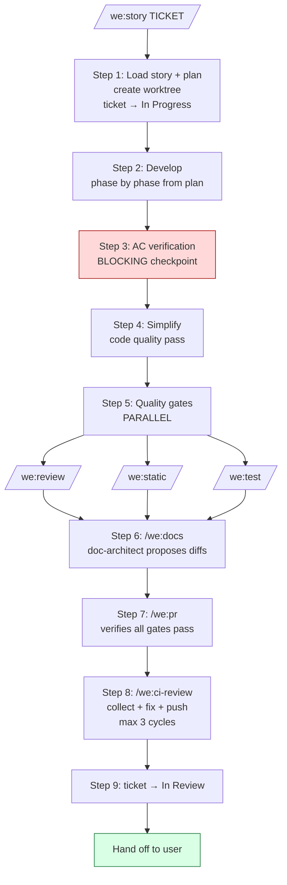

# The Workflow

Agentic Product Ownership has three phases — *plan*, *build*, *deliver*. The plugin gives you one skill per phase, plus a deeper pipeline inside the build phase that runs autonomously when you trigger it.

This page maps the full pipeline and explains where each skill fits. For learning by doing, start with [getting-started.md](getting-started.md). For the why behind the structure, see [agenticproductownership.com](https://agenticproductownership.com).

---

## The big picture

```mermaid
flowchart LR
    V[Vision] --> R[/we:refine<br/>interactive]
    R --> S[/we:story<br/>autonomous]
    S --> M[User merges PR<br/>+ closes ticket]
    M --> D[Done]

    style V fill:#fff,stroke:#888
    style R fill:#ffefd9,stroke:#c87f00
    style S fill:#d9ffe5,stroke:#1a7a3c
    style M fill:#fff,stroke:#888
    style D fill:#fff,stroke:#888
```

Three phases, three responsibilities:

| Phase | Who | What | Command |
|---|---|---|---|
| **Plan** | You + Claude (interactive) | Story + plan | `/we:refine` |
| **Build** | Claude (autonomous) | Code → review → test → docs → PR → CI | `/we:story` |
| **Deliver** | You (manual) | Review PR, merge, close ticket | GitHub / Ticketing |

**Claude never merges PRs or closes tickets.** Those stay with you.

---

## Phase 1: Plan with `/we:refine`

You bring an idea — a short sentence, a Jira ticket key, a description. `/we:refine` asks the questions that turn it into a story you can actually build.

The conversation produces two things:

- **Ticket** (minimal): "As X I want Y so that Z" + link to the plan
- **Plan** (`docs/plans/{TICKET}-plan.md`, detailed): context, acceptance criteria, phased implementation, tests, security review, design decisions

Context flows: the plan's *Context* and *Design Decisions* sections capture why you decided what you decided — including rejected alternatives. The next skill, `/we:story`, reads this and understands intent, not just spec.

For contentious stories, use `/we:meet refinement` instead — convenes a small council (PO + architect) for two perspectives before the plan crystallizes. Hands off to `/we:refine` once aligned. See [concepts/meetings.md](concepts/meetings.md).

---

## Phase 2: Build with `/we:story`

You hand the ticket key to `/we:story`. It runs the entire build pipeline autonomously — you can watch, you don't have to drive.



### Step-by-step

| Step | What | Notes |
|---|---|---|
| **1. Git prep** | Worktree, branch, ticket → In Progress | Worktree isolates the work; if you opt out (`no worktree`), uses a regular branch |
| **2. Develop** | Implement plan phase by phase | TDD: tests alongside code. Auto-fix runs after each phase. |
| **3. AC verify** | Every acceptance criterion checked with concrete evidence | **Blocking.** No item passes without a citation (file:line, test name, commit). |
| **4. Simplify** | `simplify` skill (from `code-simplifier` plugin) | Removes dead code, simplifies expressions, reuses existing helpers |
| **5. Quality gates** | Code review + static analysis + tests, all in parallel | Three subagents, single message dispatch — concurrent execution |
| **6. Docs** | `doc-architect` agent proposes doc updates | Never writes autonomously — every change is a diff proposal |
| **7. PR** | `/we:pr` verifies all 3 quality-gate checkpoints first | Will not create a PR with failing gates. CodeRabbit then runs on GitHub. |
| **8. CI fix** | Inline loop — collect findings, fix all, resolve threads, push once | Max 3 cycles. CodeRabbit threads MUST be resolved before push. |
| **9. Ticket** | Move ticket to In Review | Done by `pr-creator`; verified after. Never moves to Done — that's you. |

### Robustness

| Feature | What it does |
|---|---|
| **Checkpoints** | SQLite at `~/.claude/weside/orchestration.db`. Resume after interruption with `/we:story {TICKET}` — picks up where it stopped. |
| **Circuit breaker** | 3 failures in the same phase → stop and ask. Prevents thrashing. |
| **Batch-fix pattern** | Collect ALL findings, fix in ONE commit, push ONCE. One CI cycle, not three. |
| **Reality check** | Warns if the plan is stale vs. recent code changes. Refuses to proceed with an out-of-date plan. |

### The forbidden interruption

`/we:story` does **not** ask you "should I run this end-to-end or phase by phase" at the start. By the time you've handed it a ticket, you've already decided. The phases-from-the-plan run sequentially with checkpoints. That *is* what "phased" means here.

Legitimate interruptions stay:
- Circuit breaker (3 failures in same phase)
- AC verification gate (blocking by design)
- Plan ambiguity that blocks implementation (concrete, named gap)
- Destructive action requiring confirmation (force-push, dropping data, etc.)

Token pressure is not a legitimate reason — the runtime handles compaction; the checkpoint system survives it.

---

## Phase 3: Deliver

You receive a PR with:

- All acceptance criteria implemented
- Tests passing
- Code reviewed (by `code-reviewer` + CodeRabbit on GitHub)
- Docs proposed and applied
- CI green
- Ticket in *In Review*

You review the PR (your eyes, your call), merge it, close the ticket. Done.

---

## Where the other skills sit

The pipeline above is the spine. The standalone skills serve specific needs around it:

```mermaid
flowchart TB
    subgraph spine[Pipeline spine]
        refine[/we:refine/]
        story[/we:story/]
        cireview[/we:ci-review<br/>inline in /we:story]
    end
    subgraph deliberation[Deliberation]
        council[/we:council/]
        meet[/we:meet/]
    end
    subgraph process[Process improvement]
        sm[/we:sm<br/>retro after something broke/]
        arch[/we:arch<br/>architecture decisions/]
    end
    subgraph review[Review + audit]
        docimprove[/we:doc-improve/]
        audit[/we:audit/]
        auditarch[/we:audit-architecture/]
        find[/we:find-dead-code/]
        smoke[/we:smoketest/]
    end
    subgraph framework[Framework]
        setup[/we:setup<br/>once per project/]
        onboard[/we:onboarding/]
        sideload[/we:sideload/]
    end
    subgraph weside[Optional: weside]
        materialize[/we:materialize/]
    end

    setup --> framework
    council --> deliberation
    meet --> deliberation
    refine --> spine
    story --> spine
```

Read each skill's reference in [skills.md](skills.md), or browse the relevant concept doc:

- **Deliberation** — [concepts/meetings.md](concepts/meetings.md), [concepts/roles.md](concepts/roles.md)
- **Framework** — [concepts/companion-framework.md](concepts/companion-framework.md)
- **Memory** (when weside is active) — [concepts/memory.md](concepts/memory.md)

---

## When the pipeline doesn't fit

Three common cases where you sidestep `/we:story`:

- **Hotfix** — typo, dependency bump, copy change. Open a PR by hand; `/we:story` overhead isn't worth it for trivial changes.
- **Exploration** — you don't know what you're building yet. Use `/we:meet vision` or `/we:meet initiative` to deliberate first, then `/we:refine` once direction emerges.
- **Cross-repo coordination** — `/we:sideload <other-repo>` to pull context, then plan + execute. The pipeline still works per repo; the sideload bridges them.

---

## Without a weside account

The pipeline runs end-to-end. Checkpoints work. Quality gates work. Docs get proposed. CI gets fixed. You ship.

Three things look different:

- `/we:refine` doesn't ground a new story in cross-session memory — it works from the current conversation + plan files.
- `/we:council` and `/we:meet` use generic role-agents instead of named Companions.
- `/we:sm` and `/we:arch` boot without companion identity.

You still get a pipeline that ships code. You don't get a teammate who remembers across days.

## With a weside account

Same pipeline. Same skills. Same checkpoints. The difference is **continuity** — each skill that loads a Companion identity (via `/we:materialize` or auto-materialize) carries its memory of past stories, councils, and decisions into the current task.

For the upgrade path, see [upgrade-paths.md](upgrade-paths.md).

---

## References

- [getting-started.md](getting-started.md) — learn by doing
- [skills.md](skills.md) — per-skill reference
- [concepts/companion-framework.md](concepts/companion-framework.md) — what the framework adds around the pipeline
- [concepts/meetings.md](concepts/meetings.md) — when to deliberate before refining
- [troubleshooting.md](troubleshooting.md) — common pipeline issues
