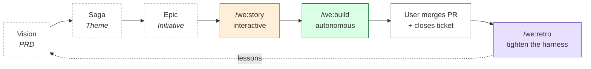
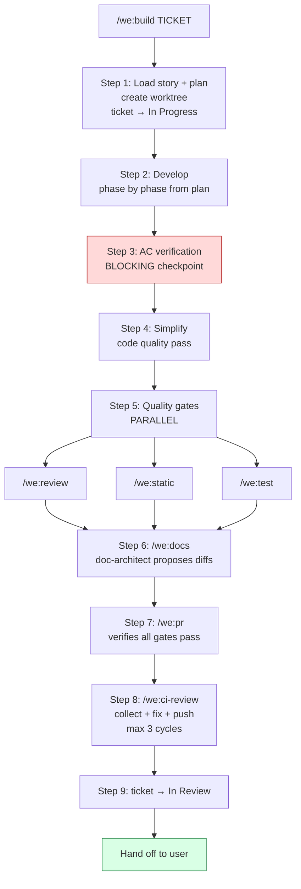
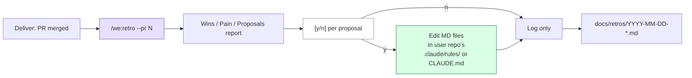
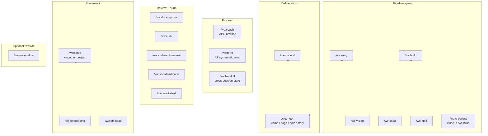

# The Workflow

Agentic Product Ownership has four phases — *plan*, *build*, *deliver*, *retro*. The plugin gives you four altitudes of Plan skills, one autonomous Build skill, a Deliver phase that stays with you, and a Retro phase that feeds lessons from the just-shipped cycle back into the rules and CLAUDE.md files that govern the next one.

This page maps the full pipeline and explains where each skill fits. For learning by doing, start with [getting-started.md](getting-started.md). For the why behind the structure, see [agenticproductownership.com](https://agenticproductownership.com).

---

## The big picture

Four phases, four responsibilities:

| Phase | Who | What | Command |
|---|---|---|---|
| **Plan** | You + Claude (interactive) | Vision / Saga / Epic / Story + build-ready plan | `/we:vision`, `/we:saga`, `/we:epic`, `/we:story` (+ `/we:meet`) |
| **Build** | Claude (autonomous) | Code → review → test → docs → PR → CI | `/we:build` |
| **Deliver** | You (manual) | Review PR, merge, close ticket | GitHub / Ticketing |
| **Retro** | You + Claude (interactive) | Find frictions in the just-shipped cycle; encode lessons in `.claude/rules/` + `CLAUDE.md` so they don't recur | `/we:retro` (Coach can suggest it after a merge) |

**Claude never merges PRs or closes tickets.** Those stay with you. **Claude never silently applies retro fixes** either — every proposal passes through a `[y/n]` gate.

The upper Plan altitudes (Vision, Saga, Epic) are drawn lighter because most stories enter the pipeline at Story-altitude — by the time you trigger `/we:story`, the upstream work has usually already happened (in a previous session, in a Council meeting, or in your head). When it hasn't, walk top-down: `/we:vision` → `/we:meet vision` → `/we:saga` → `/we:meet saga` → `/we:epic` → `/we:meet epic` → `/we:story` → `/we:build`. Skipping levels is allowed — when the level above is stable, you don't need to re-do it.

---

## Phase 1: Plan

Plan has four altitudes. Each one has a **Solo** skill (formulate / refine the item) and a **Meet** variant (convene a Council to decompose into the next altitude down).

| Altitude | Item | Solo | Council | Produces |
|---|---|---|---|---|
| **Vision** | PRD (reason a product exists) | `/we:vision` | `/we:meet vision` | Sagas |
| **Saga** | Theme (multi-bet) | `/we:saga` | `/we:meet saga` | Epics |
| **Epic** | Initiative (bounded slice) | `/we:epic` | `/we:meet epic` | Stories |
| **Story** | Feature slice (one concrete change) | `/we:story` | `/we:meet story` | Build-ready plan |

The altitudes used to carry time labels (multi-year / multi-quarter / quarter / sprint). They're gone because implementer speed varies wildly — calendar windows are unreliable when an AI partner ships in hours what a human estimates in days. Size by *bet shape* — does it have an end, does it ship a coherent change. The Plan skills enforce this with soft warnings, never hard blocks.

**Solo formulates an N-item; Meet decomposes an N-item into N+1-items.** A useful cadence is: Solo to sharpen the current item → Meet to decompose into the next level → Solo on each child → and so on. The two modes interleave naturally as you walk the altitudes down. See [concepts/meetings.md](concepts/meetings.md) for when to convene a Council.

The Saga and Epic Solo skills run **Status as their default mode** — `/we:saga` with no further intent loads the SAGA doc, mirrors child Epics from the ticketing tool, renders a snapshot + drift + a risk-driven next-move recommendation. Same for `/we:epic` with its child Stories. Refine, Create, and Mirror-refresh are alternative modes the skill picks automatically from the user's prompt. No flags to memorise.

The most common entry point is `/we:story`. It asks the questions that turn an idea (a sentence, a Jira ticket key, a description) into a Story you can build.

`/we:story` produces two things:

- **Ticket** (minimal): "As X I want Y so that Z" + link to the plan
- **Plan** (`docs/plans/{TICKET}-story.md`, detailed): context, acceptance criteria, phased implementation, tests, security review, design decisions

Context flows: the plan's *Context* and *Design Decisions* sections capture why you decided what you decided — including rejected alternatives. `/we:build` reads this and understands intent, not just spec.

For contentious stories, run `/we:meet story` first — convenes a small council (PO + Architect) for two perspectives before the plan crystallizes. Hands off to `/we:story` once aligned. The other Meet variants (`/we:meet vision|saga|epic`) work the same way, with rosters tuned to the altitude.

---

## Phase 2: Build with `/we:build`

You hand the ticket key to `/we:build`. It runs the entire build pipeline autonomously — you can watch, you don't have to drive.

> **Back-compat:** the orchestration CLI keeps the internal `story` table name; interrupted builds always resume cleanly when re-invoked.

### Step-by-step

| Step | What | Notes |
|---|---|---|
| **1. Git prep** | Worktree, branch, ticket → In Progress | Worktree isolates the work; if you opt out (`no worktree`), uses a regular branch |
| **2. Develop** | Implement plan phase by phase | TDD: tests alongside code. Auto-fix runs after each phase. |
| **3. AC verify** | Every acceptance criterion checked with concrete evidence | **Blocking.** No item passes without a citation (file:line, test name, commit). |
| **4. Simplify** | `simplify` skill (from `code-simplifier` plugin) | Removes dead code, simplifies expressions, reuses existing helpers |
| **5. Quality gates** | Local reviewers + static analysis + tests, all in parallel | Three subagents, single message dispatch. Which local reviewers run is config-driven: the story's `review_intensity` (light/standard/deep) selects the first-N of the repo's `review.available` local reviewers (`claude` code-reviewer, `codex`). |
| **6. Docs** | `doc-architect` agent proposes doc updates | Never writes autonomously — every change is a diff proposal |
| **7. PR** | `/we:pr` verifies all 3 quality-gate checkpoints first | Will not create a PR with failing gates. The repo's configured CI reviewers (`review.available`, e.g. CodeRabbit) run on GitHub if installed; other hosts use local quality gates. |
| **8. CI fix** | Inline loop — collect findings, fix all, push once | Max 3 cycles. Bot threads resolved when present (allowlist = `review.available`); otherwise local gates are authoritative. |
| **9. Ticket** | Move ticket to In Review | Done by `pr-creator`; verified after. Never moves to Done — that's you. |

### Robustness

| Feature | What it does |
|---|---|
| **Checkpoints** | SQLite at `~/.claude/weside/orchestration.db`. Resume after interruption with `/we:build {TICKET}` — picks up where it stopped. (Table name is still `story` for back-compat.) |
| **Circuit breaker** | 3 failures in the same phase → stop and ask. Prevents thrashing. |
| **Batch-fix pattern** | Collect ALL findings, fix in ONE commit, push ONCE. One CI cycle, not three. |
| **Reality check** | Warns if the plan is stale vs. recent code changes. Refuses to proceed with an out-of-date plan. |

### The forbidden interruption

`/we:build` does **not** ask you "should I run this end-to-end or phase by phase" at the start. By the time you've handed it a ticket, you've already decided. The phases-from-the-plan run sequentially with checkpoints. That *is* what "phased" means here.

Legitimate interruptions stay:
- Circuit breaker (3 failures in same phase)
- AC verification gate (blocking by design)
- Plan ambiguity that blocks implementation (concrete, named gap)
- Destructive action requiring confirmation (force-push, dropping data, etc.)

Token pressure is not a legitimate reason — the runtime handles compaction; the checkpoint system survives it.

---

## Phase 3: Deliver

You receive a PR with:

- All acceptance criteria implemented
- Tests passing
- Code reviewed (by the repo's configured reviewers — `code-reviewer` + any local/CI reviewers in `review.available`; local quality gates are authoritative when no GitHub reviewer is present)
- Docs proposed and applied
- CI green
- Ticket in *In Review*

You review the PR (your eyes, your call), merge it, close the ticket. Done. There is no plugin skill for Deliver on purpose — autonomy ends where consequence begins.

---

## Phase 4: Retro with `/we:retro`

The cycle doesn't end at Deliver — it closes. Every PR teaches something: a CI check that flipped red, a CodeRabbit thread that blocked merge, a workflow gap that cost two extra cycles, a manual correction the agent should have known to skip. `/we:retro` is where those lessons stop being one-off Slack threads and start being durable rules.

### What it does

| Step | What |
|---|---|
| **Source scope** | Default: current branch + last merged PR. `--pr N` for a specific PR. `--scan N` to also read the last N retros in `docs/retros/` for recurring patterns. |
| **Data fetch** | Session transcript (what the agent did) + external CI/review data via `gh api` on GitHub (CI checks, CodeRabbit threads, push-fix-push cycles) — or the session transcript alone when `gh` is unavailable. |
| **Triage** | Each friction classified by surface: CI/static, CI/tests, CI/build, Review/CodeRabbit, Review/human, Workflow/cycle-count, Agent/manual-correction, Agent/iteration-loop, Tooling/friction. |
| **Propose** | Each friction → 1–2 concrete MD-file proposals with default placement (preferring user-repo `.claude/rules/` over `CLAUDE.md` over `docs/`; plugin MDs rare and explicitly flagged), effort tag, diff preview. |
| **Per-item gate** | `[y / n / edit-path / skip-for-later]` for each proposal. Never silent. |
| **Apply** | Approved items → Edit/Write. Default PR-workflow in user repo; direct-commit if repo configured that way. |
| **Log** | Always writes `docs/retros/YYYY-MM-DD-<topic>.md` with structured frontmatter — the corpus future `--scan` runs read for patterns. |

### Privacy guard

The skill reads session transcripts and must skip personal content (Companion-mode conversations, memory writes about the user, `save_compass` payloads). Engineering surfaces only — tool calls, file diffs, CI logs, PR comments. See [`we/skills/retro/SKILL.md`](../we/skills/retro/SKILL.md) for the full rule.

### Coach can suggest it

`/we:coach` watches for retro-worthy signals during its Boot Protocol — recent PR merge, CI cycles ≥ 3, end-of-session prompts — and offers `/we:retro` via a `[y/n]` gate. Never auto-fires.

**Motto:** *Jeder Fehler passiert nur einmal.* Every error happens exactly once; the next time it shows up, it's a rule the agent already follows.

---

## Where the other skills sit

The pipeline above is the spine. The standalone skills serve specific needs around it:

Read each skill's reference in [skills.md](skills.md), or browse the relevant concept doc:

- **Deliberation** — [concepts/meetings.md](concepts/meetings.md), [concepts/roles.md](concepts/roles.md)
- **Framework** — [concepts/companion-framework.md](concepts/companion-framework.md)
- **Memory** (when weside is active) — [concepts/memory.md](concepts/memory.md)
- **Retro** (KVP loop) — [concepts/retro.md](concepts/retro.md)
- **Handoff** (cross-session continuity) — [concepts/handoff.md](concepts/handoff.md)

### Continuity utilities

Two operational skills sit alongside the spine and handle the boundary problems that come up when work spans multiple sessions:

- **`/we:retro`** — *after* a cycle: scans what just shipped (session + PR + CI), proposes rule changes so the friction doesn't recur. Writes `docs/retros/YYYY-MM-DD-*.md`.
- **`/we:handoff`** — *between* sessions: captures the current state (decisions, dead ends, files touched, next steps) to `docs/handoffs/YYYY-MM-DD-*.md`. A future session loads it back with a plain `/we:handoff` and continues. Replaces `/compact` as the primary tool for cross-session continuity (`/compact` still wins for in-session token reclamation).

Both are `/we:coach`-aware — Coach surfaces an active handoff at boot and suggests `/we:handoff --write` at end-of-session signals; same `[y/n]` discipline as advisor command launches.

---

## When the pipeline doesn't fit

Three common cases where you sidestep the spine:

- **Hotfix** — typo, dependency bump, copy change. Open a PR by hand; `/we:build` overhead isn't worth it for trivial changes.
- **Exploration** — you don't know what you're building yet. Use `/we:meet vision`, `/we:meet saga`, or `/we:meet epic` for upstream deliberation, then walk the altitudes down once direction emerges.
- **Cross-repo coordination** — `/we:sideload <other-repo>` to pull context, then plan + execute. The pipeline still works per repo; the sideload bridges them.

---

## Without a weside account

The pipeline runs end-to-end. Checkpoints work. Quality gates work. Docs get proposed. CI gets fixed. You ship.

Three things look different:

- The Plan skills (`/we:vision`, `/we:saga`, `/we:epic`, `/we:story`) don't ground new artifacts in cross-session memory — they work from the current conversation + plan files.
- `/we:council` and `/we:meet` convene each role as a generic role-agent rather than a named Companion. (With an account, a council is a mix: each role-lens is either generic or weside-backed, governed by the `loadCouncilFromWeside` toggle — see [upgrade-paths.md](upgrade-paths.md).)
- `/we:coach` boots without companion identity.

You still get a pipeline that ships code. You don't get a teammate who remembers across days.

## With a weside account

Same pipeline. Same skills. Same checkpoints. The difference is **continuity** — each skill that loads a Companion identity (via `/we:materialize` or auto-materialize) carries its memory of past stories, councils, and decisions into the current task.

For the upgrade path, see [upgrade-paths.md](upgrade-paths.md).

---

## References

- [getting-started.md](getting-started.md) — learn by doing
- [skills.md](skills.md) — per-skill reference
- [concepts/companion-framework.md](concepts/companion-framework.md) — what the framework adds around the pipeline
- [concepts/meetings.md](concepts/meetings.md) — when to deliberate at which altitude
- [troubleshooting.md](troubleshooting.md) — common pipeline issues
