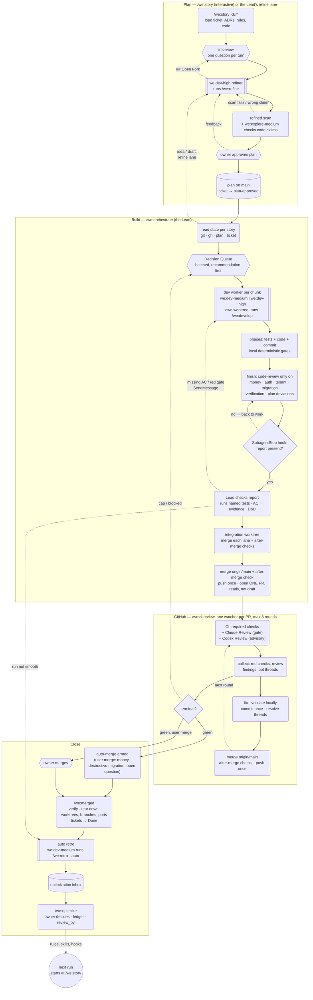

# Workflow

## The whole loop

From the first `/we:story` to `/we:merged`. Rounded boxes are skills, `[[…]]` agents, hexagons
human decisions, cylinders the records the loop writes. Every loop back is a dotted edge.

```mermaid
flowchart TD
    %% ---------- Plan ----------
    subgraph PLAN["Plan — /we:story (interactive) or the Lead's refine lane"]
        S1("/we:story KEY<br/>load ticket, ADRs, rules, code")
        S2{{"interview<br/>one question per turn"}}
        S3[["we:dev-high refiner<br/>runs /we:refine"]]
        S4("refined scan<br/>+ we:explore-medium checks code claims")
        S5{{"owner approves plan"}}
        S6[("plan on main<br/>ticket → plan-approved")]
        S1 --> S2 --> S3 --> S4
        S4 -. "scan fails / wrong claim" .-> S3
        S3 -. "## Open Fork" .-> S2
        S4 --> S5
        S5 -. "feedback" .-> S3
        S5 --> S6
    end

    %% ---------- Orchestrate ----------
    subgraph LEAD["Build — /we:orchestrate (the Lead)"]
        O1("read state per story<br/>git · gh · plan · ticket")
        O2{{"Decision Queue<br/>batched, recommendation first"}}
        O3[["dev worker per chunk<br/>we:dev-medium | we:dev-high<br/>own worktree, runs /we:develop"]]
        O4("phases: tests + code + commit<br/>local deterministic gates")
        O5("finish: code-review only on<br/>money · auth · tenant · migration<br/>verification · plan deviations")
        O6{"SubagentStop hook:<br/>report present?"}
        O7("Lead checks report<br/>runs named tests · AC → evidence · DoD")
        O8("integration worktree<br/>merge each lane + after-merge checks")
        O9("merge origin/main + after-merge check<br/>push once · open ONE PR, ready, not draft")
        O1 --> O2
        O2 --> O3 --> O4 --> O5 --> O6
        O6 -. "no → back to work" .-> O5
        O6 -- "yes" --> O7
        O7 -. "missing AC / red gate<br/>SendMessage" .-> O3
        O7 --> O8 --> O9
    end

    %% ---------- GitHub ----------
    subgraph GH["GitHub — /we:ci-review, one watcher per PR, max 3 rounds"]
        G1("CI: required checks<br/>+ Claude Review (gate)<br/>+ Codex Review (advisory)")
        G2("collect: red checks, review<br/>findings, bot threads")
        G3("fix · validate locally<br/>commit once · resolve threads")
        G4("merge origin/main<br/>after-merge checks · push once")
        G5{"terminal?"}
        G1 --> G2 --> G3 --> G4
        G4 -. "next round" .-> G1
        G2 --> G5
    end

    %% ---------- Close ----------
    subgraph CLOSE["Close"]
        C1("auto-merge armed<br/>(user merge: money, destructive migration, open question)")
        C2{{"owner merges"}}
        C3("/we:merged<br/>verify · tear down worktrees, branches, ports<br/>tickets → Done")
        C4[["auto retro<br/>we:dev-medium runs /we:retro --auto"]]
        C5[("optimization inbox")]
        C6("/we:optimize<br/>owner decides · ledger · review_by")
        C1 --> C3
        C2 --> C3
        C3 --> C4 --> C5 --> C6
    end

    S6 --> O1
    O1 -. "idea / draft:<br/>refine lane" .-> S3
    O9 --> G1
    G5 -- "green" --> C1
    G5 -- "green, user merge" --> C2
    G5 -. "cap / blocked" .-> O2
    O7 -. "run not smooth" .-> C4
    C6 -. "rules, skills, hooks" .-> NEXT(("next run<br/>starts at /we:story"))
```

## Plan: four altitudes

| Altitude | Artifact | Solo verb | Meeting |
|---|---|---|---|
| Vision | PRD at `docs/plans/<vision>/PRD.md` | `/we:vision` | `/we:meet vision` → Sagas |
| Saga | theme | `/we:saga` | `/we:meet saga` → Epics |
| Epic | initiative | `/we:epic` | `/we:meet epic` → Stories |
| Story | build-ready plan at `docs/plans/<KEY>-story.md` | `/we:story` | `/we:meet story` |

A Solo verb writes or sharpens its document and shows status by default. A meeting validates the
artifact, optionally convenes the council, and decomposes it one altitude down. `/we:grill`
stress-tests any plan one question at a time. Altitudes and rosters are defined in
[we/references/apo-hierarchy.md](../we/references/apo-hierarchy.md).

## Build: one Lead, one PR

`/we:orchestrate` is the Lead. It reads each story's state from git, dispatches a refiner
(`/we:refine`) for a story without a plan, and a dev worker (`/we:develop`) for a story with an
approved plan. The worker implements the phases in its own worktree, runs the local gates, commits
and reports; it opens no PR and runs no CI. Local review is deterministic (hooks, the affected
tests); the only local LLM review is one `code-review` at `high` for money, auth, tenant isolation
or a migration, because CI runs the Claude and Codex reviews on the PR. The Lead checks the report,
merges the base, pushes once, opens one PR (`/we:pr` does the same by hand) and runs
`/we:ci-review` after CI concludes, up to three rounds.
`/we:ac-review` checks a branch against its acceptance criteria and the DoD on demand.

The dispatch contract: [we/references/worker-dispatch.md](../we/references/worker-dispatch.md).

## The effort rule

- The default worker is `we:dev-medium` (Opus, effort `medium`).
- `we:dev-high` for a promise that must hold across several code paths, for transactions, money or
  idempotency, for a fix routing around a fragile path, for a second attempt after a failed worker,
  and for plan-writing. The Lead names the reason in the dispatch.
- Implementation never runs on Sonnet. Haiku or Sonnet only for chunks the Lead names mechanical.
- One implementer per story. Parallel workers only for disjoint files with a contract that already
  exists on the base branch.

The measurements behind these rules: [we/AUTHORING.md](../we/AUTHORING.md), section *Measured facts
a skill must respect*.

## Deliver

You review and merge. `/we:merged` closes out: worktrees, branches, processes, tickets to Done.
