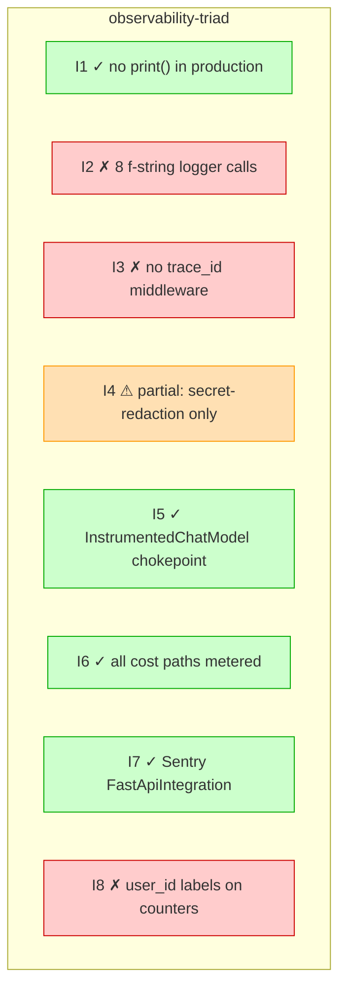

# Doc-vs-Reality Drift (Phase 3, default)

## Purpose

For every primitive-detail-doc that declares explicit invariants (`**I1.**`, `**I2.**`, ...), verify each invariant in code. Output: a drift matrix with one row per invariant, status ✓ (holds) | ⚠ (partial) | ✗ (violated) | ? (unverified).

This is the **highest-finding-value lens** because it converts implicit "the doc says X" into explicit "the code says Y, X is violated, here's the file:line evidence."

## When to apply

- **Phase 3** of `/we:audit-architecture` — runs by default in `cross_cutting:` lenses.
- **Standalone:** `--lens=doc-vs-reality-drift`
- **Project requirement:** primitive-detail-docs follow the canonical 8-section structure (see `findings-template.md` § Primitive Detail Doc Format), specifically with explicit numbered invariants `**I1. <Name>.**`, `**I2. ...**`.

## Method

Five steps:

### Step 1 — Discover Primitive Docs

```bash
# Configured glob in healthcheck.doc_drift.target_glob
ls docs/architecture/primitives/*.md
```

For weside-core: ~32 primitive docs. Each is a candidate.

### Step 2 — Extract Invariants

Manual pattern (v3.0): read each doc's `## Invariants` section, identify lines starting with `**I<N>.**` followed by an invariant statement.

Optional automation (`scripts/extract-invariants.py`, future): parse docs as markdown, extract `**I<N>.**` patterns, output `{primitive_name: [(I1_text, I2_text, ...)]}` JSON.

For v3.0, the manual catalog approach: maintain a small `invariant_catalog.yml` per project listing the invariants the team cares about + their verification recipe.

```yaml
# Optional in .audit-architecture.yml
invariant_catalog:
  observability-triad:
    - id: I1
      claim: "No print() in production code"
      verify_grep: "^\\s*print\\("
      verify_excludes: [docs/, tests/, apps/admin/, apps/support/]
    - id: I3
      claim: "Every request has a trace/correlation ID"
      verify_grep: "bind_context|RequestIDMiddleware"
      verify_must_exist: true   # this pattern MUST appear in middleware/
      verify_must_be_in: [apps/backend/app/middleware/]
    # ...
```

If the catalog is absent, the lens runs in **manual mode**: it flags primitive docs WITH explicit invariants and tells the auditor to manually verify each.

### Step 3 — Verify Each Invariant

For invariants with `verify_grep` defined, run the grep + check:
- `verify_must_exist: true` → at least one match in the codebase, else `✗`
- `verify_must_be_in: [paths]` → ALL matches must be inside listed paths, else `✗`
- `verify_excludes: [paths]` → matches in these paths are ignored
- absent → manual verdict: `?`

Output for each invariant:
```
{primitive: "observability-triad", id: "I3", verdict: "✗", evidence: "no match in apps/backend/app/middleware/"}
```

### Step 4 — Render Drift Matrix



(Severity classes: see `visualization.md`.)

### Step 5 — File Findings for Drifts

Each `✗` becomes a finding:

```markdown
### DR-MAJ-N — observability-triad I3: no trace_id middleware

**Severity:** MAJOR
**Lens:** doc-vs-reality-drift
**Primitive:** observability-triad
**Invariant:** I3 — "Every request has a trace/correlation ID"
**Cite:** `docs/architecture/primitives/observability-triad.md` claims it; `apps/backend/app/main.py:951–1029` does not register a TraceID middleware.

The primitive doc says: *"The FastAPI middleware sets `trace_id` on the structlog
context so every log line from one request is correlateable."*

The code says: 5 middlewares registered (ProxyHeaders, VersionCheck, CORS,
SlowAPI, SecurityHeaders), none of which bind `trace_id`. `bind_context()` is
defined in `core/logging.py:275` but only referenced from its own docstring.

**Resolution paths:**
1. Add a `RequestIDMiddleware` that generates UUID and calls `bind_context(request_id=uuid)` per request — closes the gap.
2. Update the primitive doc to admit the actual correlation mechanism (e.g., Loki transport-level request-id) — closes the doc-drift but doesn't add the structured field.

**Effort:** S (1-2h for option 1, 30 min for option 2).
```

Each `⚠` becomes a MINOR finding.
Each `?` becomes a NIT (audit incomplete).
Each `✓` is reported but not a finding.

## Verdict Semantics

- **✓ (holds)** — code unambiguously satisfies the invariant. Evidence: grep produced the expected matches in the expected places.
- **⚠ (partial)** — invariant holds in some places but not all. Common case: documentation-by-discipline rules (e.g., "no PII in logs") that have no structural enforcement.
- **✗ (violated)** — code contradicts the invariant. Evidence: grep produced the wrong shape (e.g., expected match doesn't exist; forbidden pattern exists).
- **? (unverified)** — invariant cannot be checked by grep alone. Common case: behavioral invariants ("at most one Haiku call per event"). Mark for manual review.

## Output Format

`<findings_dir>/cross-cutting.md` includes a section:

```markdown
## Doc-vs-Reality Drift Matrix

[Mermaid drift-matrix.mmd block]

### Drifts found (2 ✗, 1 ⚠, 0 ?)

[Findings list, severity-tagged]
```

## Examples (real, from weside-core observability audit 2026-04-26)

The observability-triad primitive has 8 invariants. Audit verdicts:

| Invariant | Claim | Verdict | Evidence |
|---|---|---|---|
| I1 | No `print()` in production | ✓ | grep clean (matches were docstrings) |
| I2 | Key-value pairs, not f-string logging | ✗ | 8 f-string logger calls (`main.py:197-199, 981, 1003, 1235, 1248`, `core/rate_limit.py:127`) |
| I3 | Every request has trace_id | ✗ | no trace_id middleware in `main.py:951-1029` |
| I4 | No PII in logs | ⚠ | `_RedactSecretsFilter` strips secrets but not user content; discipline-only |
| I5 | InstrumentedChatModel for all LLM calls | ✓ | zero vendor SDK imports outside config/llm.py (verified by Phase 1 leak count) |
| I6 | Cost-relevant ops emit metrics | ✓ | LLM_COST, VOICE_INTERNAL_COST, STRIPE_METER_EVENTS, BYOK_LLM_USAGE all present |
| I7 | Sentry captures unhandled exceptions | ✓ | `sentry_sdk.init` with FastApiIntegration + LoggingIntegration |
| I8 | Low cardinality labels | ✗ | `core/metrics.py:142, 148, 167` — user_id + companion_id on LLM_TOKENS/LLM_COST/LLM_REQUESTS |

These 3 ✗ verdicts produced 3 of the 4 MAJOR findings in the observability audit. The 4th MAJOR was the audit-yml-too-narrow scope (process finding, not primitive-drift).

## Why This Lens Matters

In the v2.19.0 run, doc-vs-reality drifts were found by accident — a grep for f-strings was triggered while reading `core/logging.py`, the missing trace_id middleware was noticed when reviewing `main.py`'s middleware list. Without this lens, finding these drifts depends on the auditor's habit of reading docs before code AND remembering specific claims.

The lens makes it systematic: every `**I<N>.**` in every primitive-doc gets a verdict.

The cost of skipping: documented-but-not-implemented invariants accumulate. Each accumulation makes the primitive-doc less trustworthy. Eventually the docs become aspirational fiction, and the team stops reading them — at which point the "Platform Primitives" architecture itself loses its enforcement mechanism.
