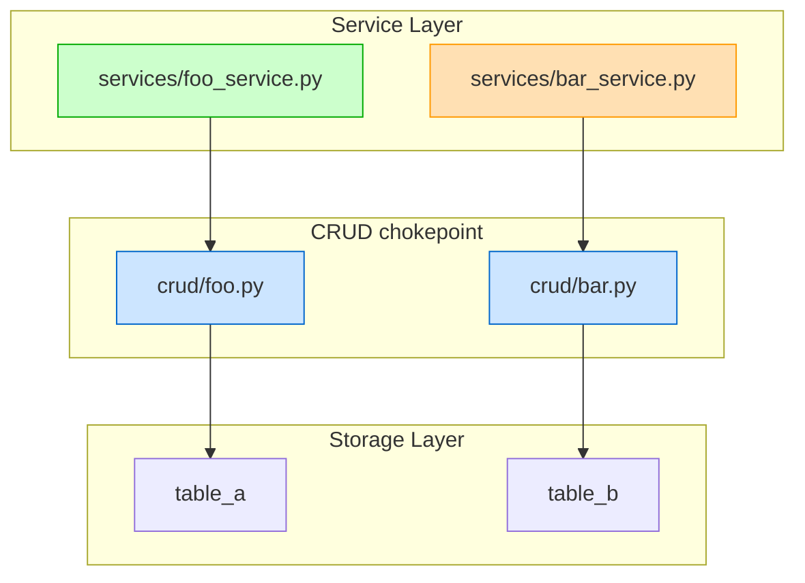
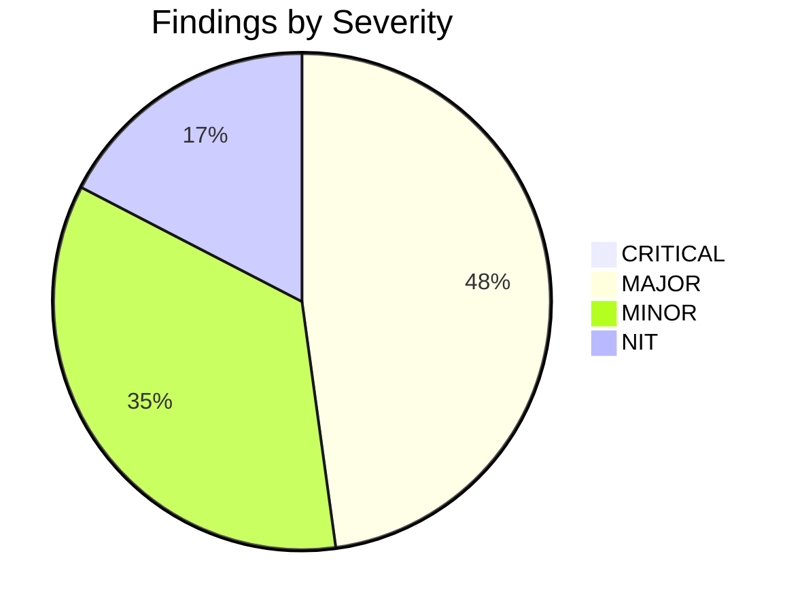
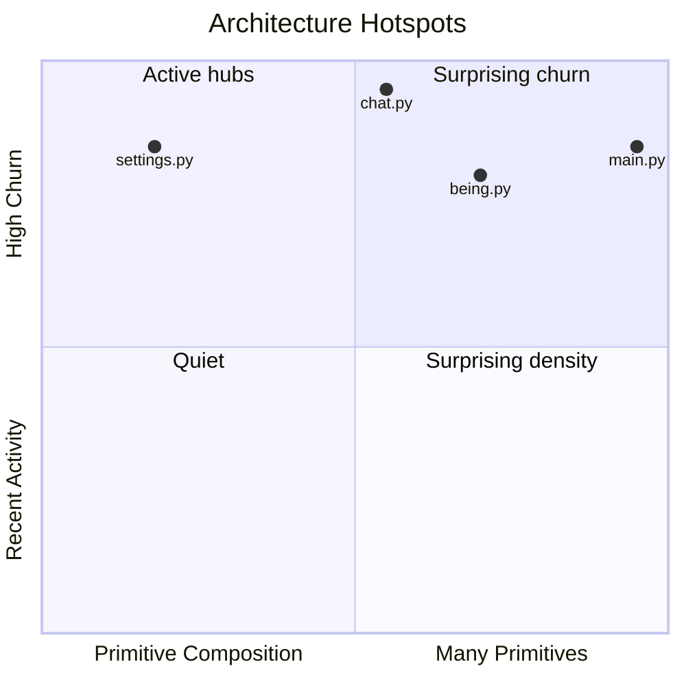
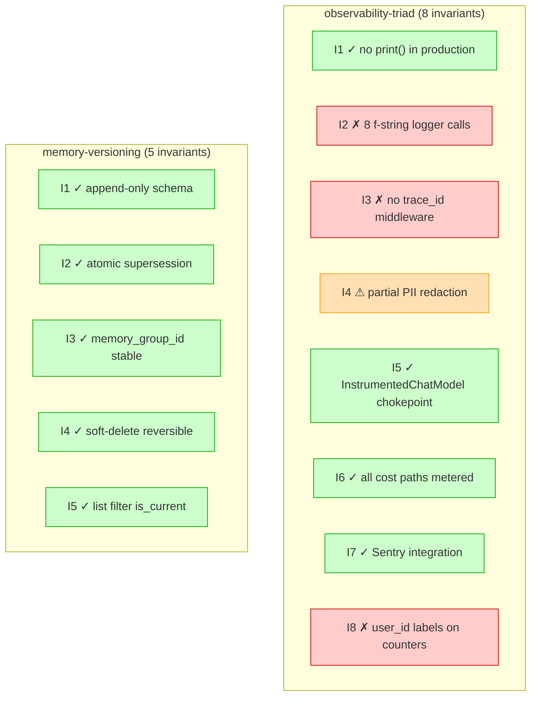
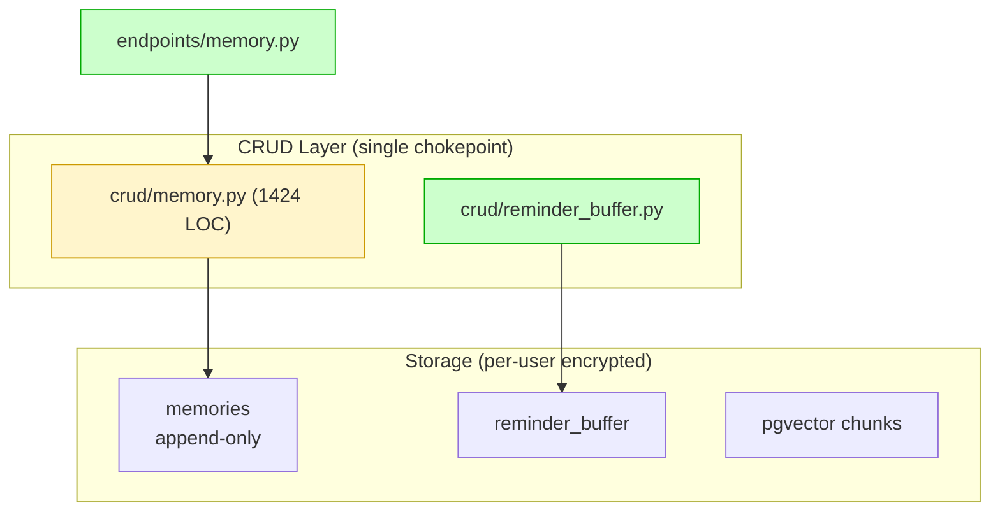

# Visualization

All diagrams produced by `/we:audit-architecture` use Mermaid (renderable in GitHub MD, supported by every modern markdown viewer). Severity is encoded as Mermaid `classDef` styles consistent across every diagram type.

## Severity CSS Registry

```mermaid
%% classDef registry — copy into every .mmd file's footer
classDef critical fill:#ffcccc,stroke:#cc0000,stroke-width:3px
classDef major    fill:#ffe0b3,stroke:#ff9900,stroke-width:2px
classDef minor    fill:#fff5cc,stroke:#cc9900
classDef nit      fill:#eee,stroke:#999
classDef clean    fill:#ccffcc,stroke:#00aa00
classDef chokepoint fill:#cce5ff,stroke:#0066cc,stroke-width:2px
classDef privateMod fill:#f5e6ff,stroke:#9900cc
```

Color reasoning:
- **Red** = CRITICAL (immediate risk, blocks merge)
- **Orange** = MAJOR (significant, should-fix)
- **Yellow** = MINOR (nice-to-fix)
- **Gray** = NIT (cosmetic)
- **Green** = CLEAN (verified compliant)
- **Blue** = chokepoint (architecturally load-bearing, expected dense)
- **Purple** = private module (encapsulation boundary)

Always include the legend section at the end of each diagram so readers can decode without context.

## Diagram Types

### Type 1 — Subsystem Flowchart (Phase 2)

One per subsystem. Nodes = modules/classes/files. Edges = composition / data flow. Severity classes applied to nodes that have findings.

Template:



**Convention:** severity-class application follows § Convention: Severity Decision below.

### Type 2 — Severity Pie Chart (Phase 4 master.md)



The skill substitutes the actual counts. Mermaid pie does not support custom colors; the chart's value is in the count distribution, not color.

### Type 3 — Hotspot Quadrant (Phase 1 / Phase 4 master.md)



- X-axis: primitive count, normalized 0-1 (max-primitive-count = 1.0)
- Y-axis: churn, normalized 0-1
- Quadrant 1 (top-right): high primitives + high churn = active hubs (expected to be dense)
- Quadrant 4 (bottom-right): high primitives + low churn = stable hubs (also expected)
- Quadrant 2 (top-left): low primitives + high churn = surprising churn (e.g., `settings.py`)
- Quadrant 3 (bottom-left): low primitives + low churn = quiet (no signal)

The skill places ✓-marked (`expected_hubs`) files in quadrant 1/4 (top-right area) and unmarked files wherever their measurements land — visually surfacing surprises as quadrant-2/4 anomalies among non-hubs.

### Type 4 — Drift Matrix (Phase 3 cross-cutting.md)



Each subgraph = one primitive doc. Each node = one invariant with verdict + summary.

### Type 5 — Optional Future: Sequence Diagrams for Specific Flows

Not required by v3 but useful when a subsystem audit needs to show a runtime flow (e.g., the 3-tier subconscious pipeline). Same severity classes apply to nodes/participants if a step in the flow has a finding.

## Mermaid Lint Considerations

- Use `<br/>` for line breaks in node labels, NOT `\n` (Mermaid syntax)
- Quote labels with special chars: `"file.py:42 (critical)"`
- Avoid pipe `|` in labels (parser conflict); use `,` or em-dash
- For flowchart subgraphs, `subgraph X["Display Title"]` displays the title; bare `subgraph X` shows `X` literally
- Mermaid does NOT support arbitrary HTML in labels; stick to `<br/>`, basic styling
- Long labels: keep under ~60 chars per line; Mermaid wraps poorly

## Diagram Files vs Inline Embedding

The skill writes both:

1. **`.mmd` file** in `<diagrams_dir>/` — version-controlled source; useful for Mermaid Live Editor + diff-against-previous (see `audit-checklist.md` § Diff)
2. **Inline ` ```mermaid ` block** in the relevant findings MD — readable on GitHub without external tooling

The MD writer copies the `.mmd` content into a `mermaid` fenced block. Both stay in sync because the `.mmd` is the source.

## Convention: Severity Decision

When applying severity classes to nodes:

1. If the node represents a file/module, apply the **maximum severity** of all findings on that file (e.g., if a file has 1 MAJOR + 3 MINORs, color it MAJOR).
2. If the node represents an aggregate (subgraph), apply the **maximum severity** of any contained node.
3. Nodes without findings get NO severity class (default styling).
4. For chokepoints / private modules, apply the structural class (`chokepoint` / `privateMod`) IF there are no findings; otherwise the severity class wins (severity > structure).

## Worked Example — Subsystem Diagram with Findings

An illustrative memory-subsystem audit produced 0 CRITICAL + 1 MAJOR + 2 MINOR + 1 NIT. Applying v3 conventions, the diagram becomes:



`crud/memory.py` is colored MINOR because of the file-size finding (M-MIN-1: 1424 LOC future-split candidate). Everything else has no findings → default-styled or `clean` if explicitly verified.

## Master.md Layout (Phase 4)

The master.md skeleton (frontmatter, Executive Summary, the three inline intensity views,
reading order, findings index, sub-file links) is owned by `findings-template.md` § master.md
Skeleton. Visual principle: the reader gets an immediate intensity sense from the three inline
charts before diving into details.
